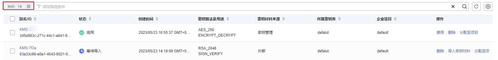

# 搜索标签

该任务指导用户通过密钥管理界面搜索标签，可搜索当前项目下满足标签搜索条件的所有的密钥管理或用户主密钥。

## 前提条件

-   已获取管理控制台的登录帐号与密码。
-   已添加标签。

## 搜索标签

1.  登录管理控制台。
2.  单击管理控制台左上角，选择区域或项目。
3.  单击页面上方的“服务列表“，选择“安全  \>  数据加密服务“，默认进入数据加密服务的“密钥管理“界面。
4.  单击目标密钥管理所在行，展开密钥管理。
5.  单击“标签搜索“，展开搜索框，如[图1](#fafed72496cdb4d4d8b199e5b55f8bd9b)所示。

    **图 1**  标签搜索框  
    

6.  在“密钥管理“下拉列表中，选择“密钥管理“或者“密钥“。

    > **说明：**   
    >-   如果选择的是“密钥管理“，那么可搜索出满足标签搜索条件的所有的密钥管理。  
    >-   如果选择的是“密钥“，那么可搜索出满足标签搜索条件的所有的用户主密钥。  

7.  在搜索框中输入“标签键“和“标签值“。
8.  单击，添加到搜索条件中，并单击“搜索“，显示满足搜索条件的用户主密钥列表，以搜索“密钥“的标签为例，如[图2](#f3fbaa49e3427467684057101575ea84e)所示。

    **图 2**  搜索结果  
    

    > **说明：**   
    >-   可添加多个标签进行组合搜索，最多支持10个不同标签的组合搜索，若进行多个标签组合搜索，则搜索结果的每个用户主密钥均满足标签组合搜索条件。  
    >-   若需要在搜索条件中删除添加的标签，可在搜索条件中单击指定标签后的，删除添加的标签。  
    >-   若需要重新添加搜索条件，可单击“重置“，重新添加搜索条件。  

