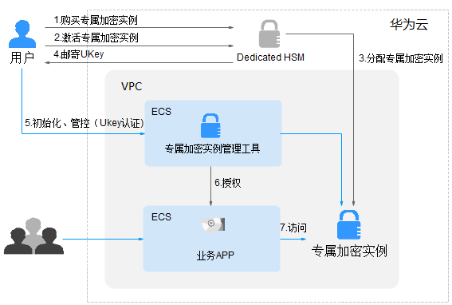

# 操作指引

## 限制说明

-   专属加密实例需要配合虚拟私有云（VPC）一起使用。购买专属加密实例后，需要在管理控制台中实例化专属加密实例（配置VPC网络、安全组、网卡），才能正常使用。
-   专属加密实例出于安全性的考虑，不对公网提供服务，您需要将专属加密实例管理工具部署到与专属加密实例同一VPC网络中，才能对专属加密实例进行管理。

## 操作指引

当用户需要在云上使用专属加密服务时，可通过Dedicated HSM界面购买专属加密实例。购买专属加密实例后，用户需要通过Dedicated HSM界面实例化专属加密实例。当用户收到Dedicated HSM邮寄的Ukey后，通过Ukey初始化，并管控专属加密实例。用户通过专属加密实例管理工具授权业务APP，允许业务用户通过业务APP访问专属加密实例。操作指引如[图1](#fig1244473721510)所示。

**图 1**  操作指引  

操作指引说明如[表1](#table844653719155)所示。

**表 1**  操作指引说明

<table><thead align="left"><tr id="row74462037191514"><th class="cellrowborder" valign="top" width="8.51914808519148%" id="mcps1.2.5.1.1">
编号

</th>
<th class="cellrowborder" valign="top" width="11.868813118688132%" id="mcps1.2.5.1.2">
操作步骤

</th>
<th class="cellrowborder" valign="top" width="68.43315668433156%" id="mcps1.2.5.1.3">
说明

</th>
<th class="cellrowborder" valign="top" width="11.178882111788822%" id="mcps1.2.5.1.4">
操作角色

</th>
</tr>
</thead>
<tbody><tr id="row1144611375155"><td class="cellrowborder" valign="top" width="8.51914808519148%" headers="mcps1.2.5.1.1 ">
1

</td>
<td class="cellrowborder" valign="top" width="11.868813118688132%" headers="mcps1.2.5.1.2 ">
购买专属加密实例

</td>
<td class="cellrowborder" valign="top" width="68.43315668433156%" headers="mcps1.2.5.1.3 ">
通过Dedicated HSM界面购买专属加密实例，详细操作请参见<a href="购买专属加密实例.md">购买专属加密实例</a>。

</td>
<td class="cellrowborder" valign="top" width="11.178882111788822%" headers="mcps1.2.5.1.4 ">
用户

</td>
</tr>
<tr id="row5305147152619"><td class="cellrowborder" valign="top" width="8.51914808519148%" headers="mcps1.2.5.1.1 ">
2

</td>
<td class="cellrowborder" valign="top" width="11.868813118688132%" headers="mcps1.2.5.1.2 ">
激活专属加密实例

</td>
<td class="cellrowborder" valign="top" width="68.43315668433156%" headers="mcps1.2.5.1.3 ">
您购买专属加密实例后，通过Dedicated HSM界面实例化专属加密实例。您需要选择专属加密实例所属的虚拟私有云，以及专属加密实例的功能类型，详细操作请参见<a href="激活专属加密实例.md">激活专属加密实例</a>。

</td>
<td class="cellrowborder" valign="top" width="11.178882111788822%" headers="mcps1.2.5.1.4 ">
用户

</td>
</tr>
<tr id="row42441826231"><td class="cellrowborder" valign="top" width="8.51914808519148%" headers="mcps1.2.5.1.1 ">
3

</td>
<td class="cellrowborder" valign="top" width="11.868813118688132%" headers="mcps1.2.5.1.2 ">
分配专属加密实例

</td>
<td class="cellrowborder" valign="top" width="68.43315668433156%" headers="mcps1.2.5.1.3 ">
用户实例化专属加密实例后，Dedicated HSM分配专属加密实例给用户。

</td>
<td class="cellrowborder" valign="top" width="11.178882111788822%" headers="mcps1.2.5.1.4 ">
专属加密服务安全专家

</td>
</tr>
<tr id="row132575315816"><td class="cellrowborder" valign="top" width="8.51914808519148%" headers="mcps1.2.5.1.1 ">
4

</td>
<td class="cellrowborder" valign="top" width="11.868813118688132%" headers="mcps1.2.5.1.2 ">
邮寄UKey并提供配套初始化文档及软件

</td>
<td class="cellrowborder" valign="top" width="68.43315668433156%" headers="mcps1.2.5.1.3 "><ul id="ul3551144043111"><li>安全专家将通过您提供的Ukey收件地址将Ukey邮寄给您。
Ukey是Dedicated HSM提供给您的身份识别卡，此卡仅购买专属加密实例的用户持有，请妥善保管。

</li></ul>
<ul id="ul1158514383118"><li>安全专家将会为您提供初始化专属加密实例的软件及相关指导文档。
若您对软件或指导文档的使用有疑问，请联系安全专家进行指导。

</li></ul>
</td>
<td class="cellrowborder" valign="top" width="11.178882111788822%" headers="mcps1.2.5.1.4 ">
专属加密服务安全专家

</td>
</tr>
<tr id="row1144614377154"><td class="cellrowborder" valign="top" width="8.51914808519148%" headers="mcps1.2.5.1.1 ">
5

</td>
<td class="cellrowborder" valign="top" width="11.868813118688132%" headers="mcps1.2.5.1.2 ">
初始化、管控（UKey认证）

</td>
<td class="cellrowborder" valign="top" width="68.43315668433156%" headers="mcps1.2.5.1.3 "><ol id="ol1875514414915"><li>在专属加密实例管理节点上安装我们为您提供的管理工具。</li><li>使用Ukey和管理工具初始化专属加密实例，并注册相应的管理员，管控专属加密实例，对密钥进行管理。</li></ol>

详细操作请参见<a href="使用专属加密实例.md#section1832742743311">初始化专属加密实例</a>。

</td>
<td class="cellrowborder" valign="top" width="11.178882111788822%" headers="mcps1.2.5.1.4 ">
用户

</td>
</tr>
<tr id="row194711433163716"><td class="cellrowborder" valign="top" width="8.51914808519148%" headers="mcps1.2.5.1.1 ">
6

</td>
<td class="cellrowborder" valign="top" width="11.868813118688132%" headers="mcps1.2.5.1.2 ">
安装安全代理软件并授权

</td>
<td class="cellrowborder" valign="top" width="68.43315668433156%" headers="mcps1.2.5.1.3 ">
在业务APP节点上安装我们为您提供的安全代理软件并执行相关初始化操作。

详细操作请参见<a href="使用专属加密实例.md#section457054185414">安装安全代理软件并授权</a>。

</td>
<td class="cellrowborder" valign="top" width="11.178882111788822%" headers="mcps1.2.5.1.4 ">
用户

</td>
</tr>
<tr id="row144614375156"><td class="cellrowborder" valign="top" width="8.51914808519148%" headers="mcps1.2.5.1.1 ">
7

</td>
<td class="cellrowborder" valign="top" width="11.868813118688132%" headers="mcps1.2.5.1.2 ">
访问

</td>
<td class="cellrowborder" valign="top" width="68.43315668433156%" headers="mcps1.2.5.1.3 ">
业务APP通过API或者SDK的方式访问专属加密实例。

</td>
<td class="cellrowborder" valign="top" width="11.178882111788822%" headers="mcps1.2.5.1.4 ">
用户

</td>
</tr>
</tbody>
</table>

