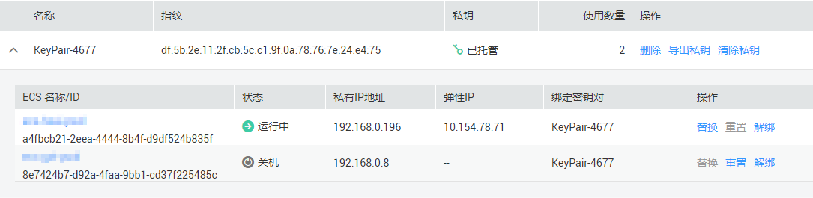

# 替换密钥对

若用户私钥泄露，用户可通过管理控制台使用新的密钥对替换弹性云服务器内的公钥，替换完成后，用户需要使用本地保存的新密钥对的私钥登录该弹性云服务器，无法使用替换前的私钥登录该弹性云服务器。

该任务指导用户通过密钥对管理界面替换密钥对。

## 前提条件

-   已获取管理控制台的登录帐号与密码。
-   待替换密钥对的弹性云服务器使用的是华为云提供的公共镜像。
-   执行密钥对替换操作是通过修改服务器的“/root/.ssh/authorized\_keys“文件的方式来替换用户公钥。请确保替换密钥对前，该文件没有被修改过，否则替换公钥会失败。
-   弹性云服务器的状态处于“运行中“状态。

## 替换密钥对

1.  登录管理控制台。
2.  单击管理控制台左上角，选择区域或项目。
3.  单击页面上方的“服务列表“，选择“安全  \>  数据加密服务“，默认进入数据加密服务的“密钥管理“界面。
4.  在左侧导航树中，选择“密钥对管理“，进入“密钥对列表“页面。

    > **说明：**   
    >用户也可以单击“云服务器列表“，进入云服务器列表页面，找到对应的弹性云服务器，单击弹性云服务器所在行的“替换“，替换密钥对。  

5.  单击目标密钥对所在行的展开密钥对，显示绑定该密钥对的弹性云服务器，如[图1](#fig1682318516365)所示。

    **图 1**  绑定密钥对的弹性云服务器  
    

6.  单击目标弹性云服务器所在行的“替换“，弹出替换密钥对的对话框，如[图2](#fig578932141819)所示。

    **图 2**  替换密钥对  
    

7.  在“新密钥对“下拉框中选择新的密钥对。
8.  单击“选择文件“，上传现有密钥对的私钥，或者将私钥拷贝至文本框中。

    上传或者拷贝至文本框的私钥必须是“.pem“格式文件，若是“.ppk“格式文件，需要通过以下步骤将“.ppk“格式文件转换为“.pem“格式文件。

    1.  双击“PUTTYGEN.exe“，打开“PuTTY Key Generator“，如[图3](#fig63492042174412)所示。

        **图 3**  PuTTY Key Generator  
        

    2.  选择“Conversions \> Import Key“导入格式为“.ppk“的私钥文件。
    3.  选择“Conversions \> Export OpenSSH Key“，弹出“PuTTYgen Warning“对话框。
    4.  单击“是“，将文件保存为“.pem“格式文件。

9.  请确认并勾选“该服务器使用华为云提供的公共镜像并未修改过SSH配置“。
10. 请阅读并勾选“我已阅读并同意《密钥对管理服务免责声明》“。
11. 单击“确定“，等待约1分钟后，完成该弹性云服务器密钥对的替换操作。

