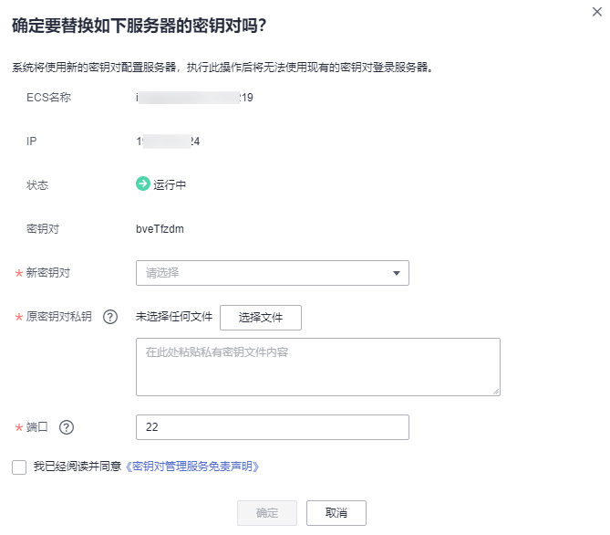

# 替换密钥对

若用户私钥泄露，用户可通过管理控制台使用新的密钥对替换弹性云服务器内的公钥，替换完成后，用户需要使用本地保存的新密钥对的私钥登录该弹性云服务器，无法使用替换前的私钥登录该弹性云服务器。

该任务指导用户通过密钥对管理界面替换密钥对。

## 前提条件

-   待替换密钥对的弹性云服务器使用的是华为云提供的公共镜像。
-   执行密钥对替换操作是通过修改服务器的“/root/.ssh/authorized\_keys“文件的方式来替换用户公钥。请确保替换密钥对前，该文件没有被修改过，否则替换公钥会失败。
-   弹性云服务器的状态处于“运行中“状态。

## 替换密钥对

1.  [登录管理控制台](https://console.huaweicloud.com)。
2.  进入替换密钥对入口。

    **图 1**  替换  
    

3.  弹出替换密钥对的对话框，如[图2](#fig578932141819)所示。

    **图 2**  替换密钥对  
    

4.  在“新密钥对“下拉框中选择新的密钥对。
5.  单击“选择文件“，上传原密钥对的私钥（“.pem“格式），或者将原密钥对的私钥拷贝至文本框中。

    > **说明：**   
    >上传或者拷贝至文本框的私钥必须是“.pem“格式文件，若是“.ppk“格式文件，请参考[如何将“.ppk”格式的私钥文件转化为“.pem”格式](https://support.huaweicloud.com/dew_faq/dew_01_0099.html)进行转换。  

6.  请阅读并勾选“我已阅读并同意《密钥对管理服务免责声明》“。
7.  单击“确定“，等待约1分钟后，完成该弹性云服务器密钥对的替换操作。

