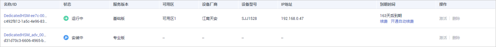
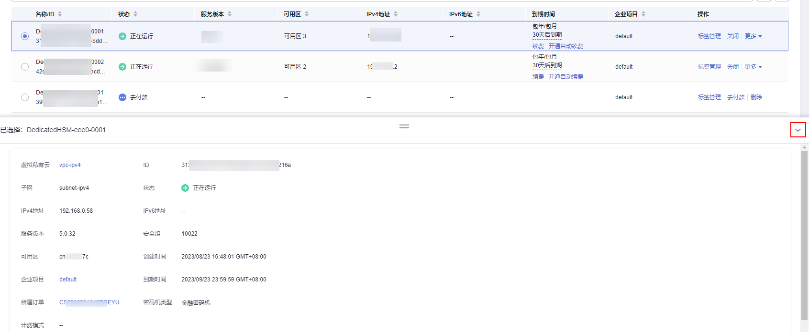
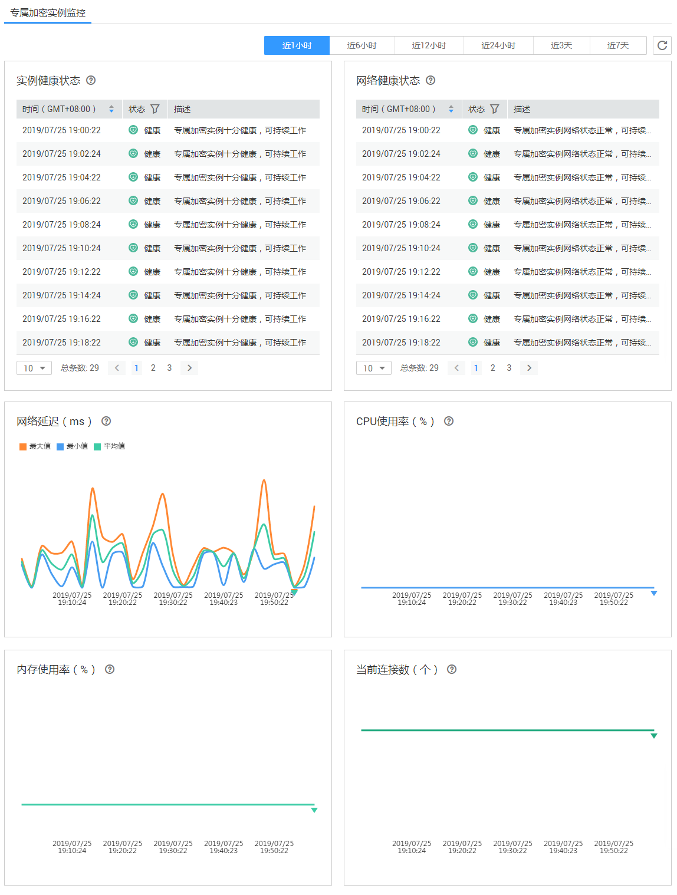

# 查看专属加密实例

该任务指导用户通过专属加密界面查看专属加密实例信息，包括专属加密实例的名称/ID、状态、服务版本、设备厂商、设备型号、IP地址和创建时间。

## 前提条件

已获取管理控制台的登录帐号与密码。

## 操作步骤

1.  登录管理控制台。
2.  单击管理控制台左上角，选择区域或项目。
3.  单击页面上方的“服务列表“，选择“安全  \>  数据加密服务“，默认进入数据加密服务的“密钥管理“界面。

1.  在左侧导航树中，选择“专属加密“，进入专属加密实例列表页面。
2.  在专属加密实例列表中，查看专属加密实例信息，如[图1](#fig367411245418)所示。

    **图 1**  专属加密实例列表  
    

    > **说明：**   
    >-   可在“名称“下拉列表中，选择“名称“或者“设备型号“，输入专属加密实例的名称或者设备型号，单击，搜索对应的专属加密实例。  
    >-   在专属加密实例处于“创建失败“或者“冻结“时，可单击该专属加密实例所在行的“删除“，删除专属加密实例。  

    专属加密实例列表参数说明，如[表1](#table1186112917296)所示。

    **表 1**  专属加密实例参数说明

    
    <table><thead align="left"><tr id="row91871529182918"><th class="cellrowborder" valign="top" width="17%" id="mcps1.2.3.1.1">
参数

    </th>
    <th class="cellrowborder" valign="top" width="83%" id="mcps1.2.3.1.2">
参数说明

    </th>
    </tr>
    </thead>
    <tbody><tr id="row4187329162912"><td class="cellrowborder" valign="top" width="17%" headers="mcps1.2.3.1.1 ">
名称/ID

    </td>
    <td class="cellrowborder" valign="top" width="83%" headers="mcps1.2.3.1.2 ">
专属加密实例的名称和ID。

    </td>
    </tr>
    <tr id="row1718702932911"><td class="cellrowborder" valign="top" width="17%" headers="mcps1.2.3.1.1 ">
状态

    </td>
    <td class="cellrowborder" valign="top" width="83%" headers="mcps1.2.3.1.2 ">
专属加密实例的状态：<ul id="ul628617423211"><li>安装中
您支付了初装费用后，系统会对您购买的实例进行安装，专属加密实例处于“安装中”状态。

    </li><li>待激活
系统已安装专属加密实例，您尚未对专属加密实例进行激活，专属加密实例处于“待激活”状态。

    </li><li>创建中
用户购买的专属加密实例实例化后，系统正在分配专属加密实例给用户，专属加密实例处于“创建中”状态。

    </li><li>创建失败
资源不够或网络故障等原因可能导致创建专属加密实例失败，专属加密实例处于“创建失败”状态。

    </li><li>运行中
实例化专属加密实例后，系统已将专属加密实例分配给用户，专属加密实例处于“运行中”状态。

    </li><li>冻结
用户购买的专属加密实例到期，且没有续费，专属加密实例处于“冻结”状态。

    </li></ul>
    

    </td>
    </tr>
    <tr id="row485424244210"><td class="cellrowborder" valign="top" width="17%" headers="mcps1.2.3.1.1 ">
服务版本

    </td>
    <td class="cellrowborder" valign="top" width="83%" headers="mcps1.2.3.1.2 ">
基础版、专业版（国内）或者专业版（海外）。<ul id="ul3963148135310"><li>基础版：用户享有共享机框和电源，在密码运算上独占加密卡的虚拟化专属加密实例。</li><li>专业版（国内）：用户独享硬件加密机机框、电源资源，独享硬件加密机网络带宽、接口资源。</li><li>专业版（海外）：用户独享硬件加密机机框、电源资源，独享硬件加密机网络带宽、接口资源。与专业版（国内）专属加密实例使用的加密算法不同。</li></ul>
    

    </td>
    </tr>
    <tr id="row01872299290"><td class="cellrowborder" valign="top" width="17%" headers="mcps1.2.3.1.1 ">
设备厂商

    </td>
    <td class="cellrowborder" valign="top" width="83%" headers="mcps1.2.3.1.2 ">
设备厂商的名称，包含“江南天安”和“三未信安”。

    </td>
    </tr>
    <tr id="row171875294292"><td class="cellrowborder" valign="top" width="17%" headers="mcps1.2.3.1.1 ">
设备型号

    </td>
    <td class="cellrowborder" valign="top" width="83%" headers="mcps1.2.3.1.2 ">
设备型号。

    </td>
    </tr>
    <tr id="row35441711113112"><td class="cellrowborder" valign="top" width="17%" headers="mcps1.2.3.1.1 ">
IP地址

    </td>
    <td class="cellrowborder" valign="top" width="83%" headers="mcps1.2.3.1.2 ">
IP地址。

    </td>
    </tr>
    <tr id="row176011933111"><td class="cellrowborder" valign="top" width="17%" headers="mcps1.2.3.1.1 ">
到期时间

    </td>
    <td class="cellrowborder" valign="top" width="83%" headers="mcps1.2.3.1.2 ">
购买的专属加密实例的到期时间。

    </td>
    </tr>
    </tbody>
    </table>

3.  用户可单击专属加密实例的名称，查看实例化后专属加密实例的详细信息，如[图2](#fig967294115113)所示。

    **图 2**  专属加密详细信息  
    

    专属加密实例详细信息参数说明，如[表2](#table22412034181211)所示。

    **表 2**  专属加密实例详细信息参数说明

    
    <table><thead align="left"><tr id="row1524383410129"><th class="cellrowborder" valign="top" width="17%" id="mcps1.2.3.1.1">
参数

    </th>
    <th class="cellrowborder" valign="top" width="83%" id="mcps1.2.3.1.2">
参数说明

    </th>
    </tr>
    </thead>
    <tbody><tr id="row16247113417126"><td class="cellrowborder" valign="top" width="17%" headers="mcps1.2.3.1.1 ">
名称

    </td>
    <td class="cellrowborder" valign="top" width="83%" headers="mcps1.2.3.1.2 ">
专属加密实例的名称。

    </td>
    </tr>
    <tr id="row292015616132"><td class="cellrowborder" valign="top" width="17%" headers="mcps1.2.3.1.1 ">
ID

    </td>
    <td class="cellrowborder" valign="top" width="83%" headers="mcps1.2.3.1.2 ">
专属加密实例的ID。

    </td>
    </tr>
    <tr id="row17522227336"><td class="cellrowborder" valign="top" width="17%" headers="mcps1.2.3.1.1 ">
状态

    </td>
    <td class="cellrowborder" valign="top" width="83%" headers="mcps1.2.3.1.2 ">
专属加密实例的状态：<ul id="dew_01_0042_ul628617423211"><li>安装中
您支付了初装费用后，系统会对您购买的实例进行安装，专属加密实例处于“安装中”状态。

    </li><li>待激活
系统已安装专属加密实例，您尚未对专属加密实例进行激活，专属加密实例处于“待激活”状态。

    </li><li>创建中
用户购买的专属加密实例实例化后，系统正在分配专属加密实例给用户，专属加密实例处于“创建中”状态。

    </li><li>创建失败
资源不够或网络故障等原因可能导致创建专属加密实例失败，专属加密实例处于“创建失败”状态。

    </li><li>运行中
实例化专属加密实例后，系统已将专属加密实例分配给用户，专属加密实例处于“运行中”状态。

    </li><li>冻结
用户购买的专属加密实例到期，且没有续费，专属加密实例处于“冻结”状态。

    </li></ul>
    

    </td>
    </tr>
    <tr id="row685024114819"><td class="cellrowborder" valign="top" width="17%" headers="mcps1.2.3.1.1 ">
服务版本

    </td>
    <td class="cellrowborder" valign="top" width="83%" headers="mcps1.2.3.1.2 ">
基础版、专业版（国内）或者专业版（海外）。<ul id="dew_01_0042_ul3963148135310"><li>基础版：用户享有共享机框和电源，在密码运算上独占加密卡的虚拟化专属加密实例。</li><li>专业版（国内）：用户独享硬件加密机机框、电源资源，独享硬件加密机网络带宽、接口资源。</li><li>专业版（海外）：用户独享硬件加密机机框、电源资源，独享硬件加密机网络带宽、接口资源。与专业版（国内）专属加密实例使用的加密算法不同。</li></ul>
    

    </td>
    </tr>
    <tr id="row426119342124"><td class="cellrowborder" valign="top" width="17%" headers="mcps1.2.3.1.1 ">
可用区

    </td>
    <td class="cellrowborder" valign="top" width="83%" headers="mcps1.2.3.1.2 ">
专属加密实例所在的可用区。

    </td>
    </tr>
    <tr id="row1427483481218"><td class="cellrowborder" valign="top" width="17%" headers="mcps1.2.3.1.1 ">
设备厂商

    </td>
    <td class="cellrowborder" valign="top" width="83%" headers="mcps1.2.3.1.2 ">
设备厂商的名称，包含“江南天安”和“三未信安”。

    </td>
    </tr>
    <tr id="row1127993421215"><td class="cellrowborder" valign="top" width="17%" headers="mcps1.2.3.1.1 ">
设备型号

    </td>
    <td class="cellrowborder" valign="top" width="83%" headers="mcps1.2.3.1.2 ">
设备型号。

    </td>
    </tr>
    <tr id="row113318723418"><td class="cellrowborder" valign="top" width="17%" headers="mcps1.2.3.1.1 ">
功能类型

    </td>
    <td class="cellrowborder" valign="top" width="83%" headers="mcps1.2.3.1.2 ">
专属加密实例的功能类型，包含“金融密码机”、“服务器密码机”和“签名服务器”。

    </td>
    </tr>
    <tr id="row18281163419125"><td class="cellrowborder" valign="top" width="17%" headers="mcps1.2.3.1.1 ">
虚拟私有云

    </td>
    <td class="cellrowborder" valign="top" width="83%" headers="mcps1.2.3.1.2 ">
专属加密实例所在虚拟私有云。

    
更多关于虚拟私有云的信息，请参见《虚拟私有云用户指南》。

    </td>
    </tr>
    <tr id="row18747183063420"><td class="cellrowborder" valign="top" width="17%" headers="mcps1.2.3.1.1 ">
子网

    </td>
    <td class="cellrowborder" valign="top" width="83%" headers="mcps1.2.3.1.2 ">
专属加密实例所在的子网。

    
更多关于子网的信息，请参见《虚拟私有云用户指南》。

    </td>
    </tr>
    <tr id="row7791549163419"><td class="cellrowborder" valign="top" width="17%" headers="mcps1.2.3.1.1 ">
IP

    </td>
    <td class="cellrowborder" valign="top" width="83%" headers="mcps1.2.3.1.2 ">
子网内的私有IP地址。

    </td>
    </tr>
    <tr id="row749685753413"><td class="cellrowborder" valign="top" width="17%" headers="mcps1.2.3.1.1 ">
安全组

    </td>
    <td class="cellrowborder" valign="top" width="83%" headers="mcps1.2.3.1.2 ">
专属加密实例所在的安全组。

    
更多关于安全组的信息，请参见《虚拟私有云用户指南》。

    </td>
    </tr>
    <tr id="row4301415193517"><td class="cellrowborder" valign="top" width="17%" headers="mcps1.2.3.1.1 ">
创建时间

    </td>
    <td class="cellrowborder" valign="top" width="83%" headers="mcps1.2.3.1.2 ">
购买专属加密实例的时间。

    </td>
    </tr>
    <tr id="row1028383416121"><td class="cellrowborder" valign="top" width="17%" headers="mcps1.2.3.1.1 ">
到期时间

    </td>
    <td class="cellrowborder" valign="top" width="83%" headers="mcps1.2.3.1.2 ">
购买的专属加密实例到期的时间。

    </td>
    </tr>
    <tr id="row29816336143"><td class="cellrowborder" valign="top" width="17%" headers="mcps1.2.3.1.1 ">
所属订单

    </td>
    <td class="cellrowborder" valign="top" width="83%" headers="mcps1.2.3.1.2 ">
购买专属加密实例的订单号，可单击订单号，查询订单详情。

    </td>
    </tr>
    <tr id="row271482513352"><td class="cellrowborder" valign="top" width="17%" headers="mcps1.2.3.1.1 ">
计费模式

    </td>
    <td class="cellrowborder" valign="top" width="83%" headers="mcps1.2.3.1.2 ">
包年/包月计费。

    </td>
    </tr>
    </tbody>
    </table>

4.  查看专属加密实例监控，包括实例健康状态、网络健康状态、网络延迟、CPU使用率、内存使用率、当前连接数。

    **图 3**  专属加密实例监控  
    

