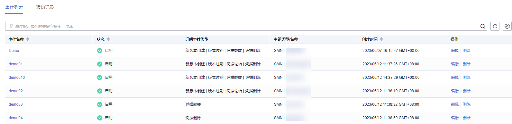
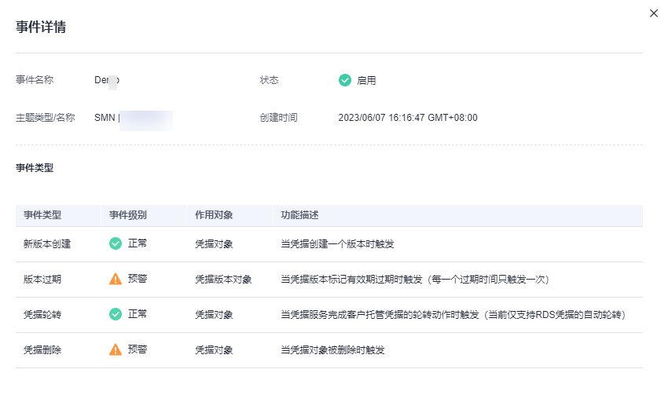

# 查看事件

该任务指导用户通过事件通知页面查看创建事件的信息，包括事件名称、状态、订阅事件类型、主题类型/名称、创建时间。

## 操作步骤

1.  [登录管理控制台](https://console.huaweicloud.com)。
2.  单击管理控制台左上角，选择区域或项目。
3.  单击页面左侧，选择“安全与合规  \>  数据加密服务“，默认进入“密钥管理“界面。
4.  在左侧导航树中，选择“凭据管理“，单击“事件通知“，进入“事件通知“页面。
5.  在事件列表中，查看事件信息，事件列表参数如[表 事件列表参数说明](#table14496736144815)所示。

    **图 1**  事件列表  
    

    **表 1**  事件列表参数说明

    
    <table><thead align="left"><tr id="row1049603620483"><th class="cellrowborder" valign="top" width="29.21%" id="mcps1.2.3.1.1">
参数名称

    </th>
    <th class="cellrowborder" valign="top" width="70.78999999999999%" id="mcps1.2.3.1.2">
参数说明

    </th>
    </tr>
    </thead>
    <tbody><tr id="row194961936134811"><td class="cellrowborder" valign="top" width="29.21%" headers="mcps1.2.3.1.1 ">
事件名称

    </td>
    <td class="cellrowborder" valign="top" width="70.78999999999999%" headers="mcps1.2.3.1.2 ">
创建事件的名称。

    </td>
    </tr>
    <tr id="row5496113615486"><td class="cellrowborder" valign="top" width="29.21%" headers="mcps1.2.3.1.1 ">
状态

    </td>
    <td class="cellrowborder" valign="top" width="70.78999999999999%" headers="mcps1.2.3.1.2 ">
事件的状态，包含

    <ul id="ul154561816185310"><li>启用
事件处于启用状态

    </li><li>禁用
事件处于禁用状态

    </li></ul>
    </td>
    </tr>
    <tr id="row749603624811"><td class="cellrowborder" valign="top" width="29.21%" headers="mcps1.2.3.1.1 ">
订阅事件类型

    </td>
    <td class="cellrowborder" valign="top" width="70.78999999999999%" headers="mcps1.2.3.1.2 ">
创建事件时选择的事件类型，包含

    <ul id="ul174551553125911"><li>新版本创建</li><li>版本过期</li><li>凭据轮转</li><li>凭据删除</li></ul>
    </td>
    </tr>
    <tr id="row124971367482"><td class="cellrowborder" valign="top" width="29.21%" headers="mcps1.2.3.1.1 ">
主题类型/名称

    </td>
    <td class="cellrowborder" valign="top" width="70.78999999999999%" headers="mcps1.2.3.1.2 ">
主题类型：默认选择SMN类型。

    
名称：用户在SMN服务中创建的主题名称。

    </td>
    </tr>
    <tr id="row1047902216314"><td class="cellrowborder" valign="top" width="29.21%" headers="mcps1.2.3.1.1 ">
创建时间

    </td>
    <td class="cellrowborder" valign="top" width="70.78999999999999%" headers="mcps1.2.3.1.2 ">
创建该事件的时间。

    </td>
    </tr>
    <tr id="row15625205215311"><td class="cellrowborder" valign="top" width="29.21%" headers="mcps1.2.3.1.1 ">
操作

    </td>
    <td class="cellrowborder" valign="top" width="70.78999999999999%" headers="mcps1.2.3.1.2 ">
用户可在操作栏中，执行编辑、删除操作。

    </td>
    </tr>
    </tbody>
    </table>

6.  单击“事件名称“，可查看事件详细信息，如[图 事件详情](#fig848692884716)所示

    **图 2**  事件详情  
    

