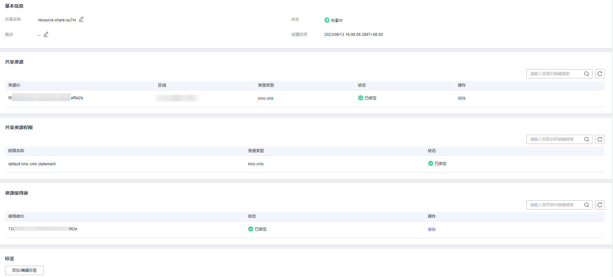

# 查看共享

用户可以通过共享管理列表查看所有已创建共享的详情，并支持在列表中进行搜索、编辑和删除共享的操作，便于管理共享。同时用户可以查看已被共享的资源以及资源使用者。

## 操作步骤

1.  [登录管理控制台](https://console.huaweicloud.com)。
2.  单击页面左上角的，选择“管理与监管 \> 资源访问管理“，进入“资源访问管理“页面。
3.  单击页面左侧“我的共享 \> 共享管理“，进入“共享管理“页面。
4.  在列表中单击需要查看的共享实例名称，进入共享详情页，查看该共享的详细配置。

    **图 1**  配置详情  
    

    > **说明：** 
    >支持用户查询已被共享的密钥资源以及资源使用者，具体操作请参见[查看您共享的资源](https://support.huaweicloud.com/usermanual-ram/ram_03_0007.html)、[查看资源使用者](https://support.huaweicloud.com/usermanual-ram/ram_03_0008.html)。

