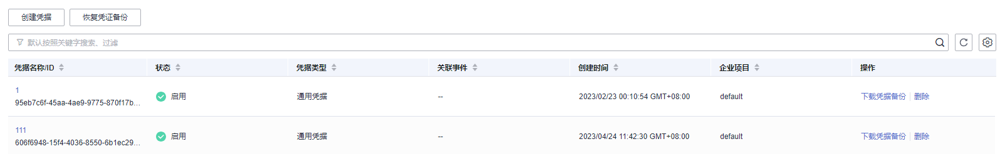

# 查看凭据

该任务指导用户通过凭据管理界面查看凭据的信息，包括凭据名称、状态和创建时间。凭据状态包括“启用“和“待删除“。

## 操作步骤

1.  [登录管理控制台](https://console.huaweicloud.com)。
2.  单击管理控制台左上角，选择区域或项目。
3.  单击页面左侧，选择“安全与合规  \>  数据加密服务“，默认进入“密钥管理“界面。
4.  在左侧导航树中，选择“凭据管理“，进入“凭据管理“页面。
5.  在凭据列表中，查看凭据信息，凭据列表参数说明，如[表1](#table1011437111712)所示。

    **图 1**  凭据列表  
    

    **表 1**  凭据列表参数说明

    
    <table><thead align="left"><tr id="row911119711179"><th class="cellrowborder" valign="top" width="24.23%" id="mcps1.2.3.1.1">
参数

    </th>
    <th class="cellrowborder" valign="top" width="75.77000000000001%" id="mcps1.2.3.1.2">
操作说明

    </th>
    </tr>
    </thead>
    <tbody><tr id="row201111175171"><td class="cellrowborder" valign="top" width="24.23%" headers="mcps1.2.3.1.1 ">
凭据名称/ID

    </td>
    <td class="cellrowborder" valign="top" width="75.77000000000001%" headers="mcps1.2.3.1.2 ">
凭据的名称。

    </td>
    </tr>
    <tr id="row71128751720"><td class="cellrowborder" valign="top" width="24.23%" headers="mcps1.2.3.1.1 ">
状态

    </td>
    <td class="cellrowborder" valign="top" width="75.77000000000001%" headers="mcps1.2.3.1.2 ">
凭据的状态，包含启用和待删除。

    </td>
    </tr>
    <tr id="row5870193011487"><td class="cellrowborder" valign="top" width="24.23%" headers="mcps1.2.3.1.1 ">
凭据类型

    </td>
    <td class="cellrowborder" valign="top" width="75.77000000000001%" headers="mcps1.2.3.1.2 ">
凭据的类型，包含通用凭据和RDS实例凭据。

    </td>
    </tr>
    <tr id="row15113674173"><td class="cellrowborder" valign="top" width="24.23%" headers="mcps1.2.3.1.1 ">
创建时间

    </td>
    <td class="cellrowborder" valign="top" width="75.77000000000001%" headers="mcps1.2.3.1.2 ">
创建该凭据的时间。

    </td>
    </tr>
    <tr id="row248410373211"><td class="cellrowborder" valign="top" width="24.23%" headers="mcps1.2.3.1.1 ">
企业项目

    </td>
    <td class="cellrowborder" valign="top" width="75.77000000000001%" headers="mcps1.2.3.1.2 ">
创建凭据绑定的企业项目ID

    </td>
    </tr>
    <tr id="row1211487121717"><td class="cellrowborder" valign="top" width="24.23%" headers="mcps1.2.3.1.1 ">
操作

    </td>
    <td class="cellrowborder" valign="top" width="75.77000000000001%" headers="mcps1.2.3.1.2 ">
用户可以在操作栏中，执行下载凭据备份、删除和撤销删除凭据等操作。

    </td>
    </tr>
    </tbody>
    </table>

6.  用户可单击凭据名称，查看凭据详细信息，如[图2](#fig14725810113147)所示。

    **图 2**  凭据详细信息  
    

    > **说明：** 
    >-   用户可单击“编辑“，修改凭据的“加密密钥“和“描述信息“。
    >-   单击“刷新“，刷新凭据信息。

