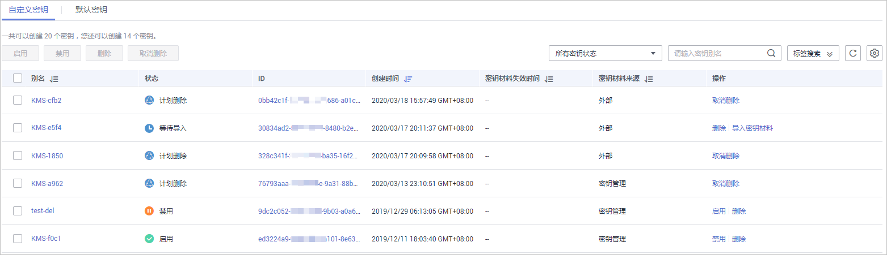
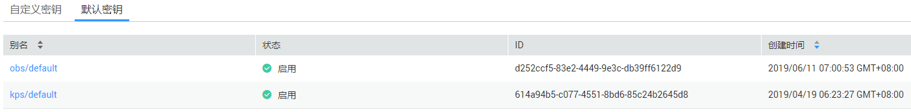
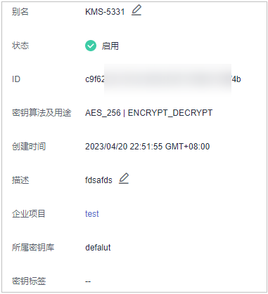

# 查看密钥

该任务指导用户通过KMS界面查看用户主密钥的信息，包括密钥别名、状态、ID和创建时间。密钥状态包括“启用“、“禁用“、“计划删除“、“等待导入“和“冻结“。

## 前提条件

已获取管理控制台的登录帐号与密码。

## 查看密钥

1.  登录管理控制台。
2.  单击管理控制台左上角，选择区域或项目。
3.  单击页面上方的“服务列表“，选择“安全  \>  数据加密服务“，默认进入数据加密服务的“密钥管理“界面。

1.  在密钥列表中，查看密钥信息。

    **图 1**  自定义密钥列表  
    

    **图 2**  默认密钥列表  
    

    密钥列表参数说明，如[表1](#table124973611167)所示。

    **表 1**  密钥列表参数说明

    
    <table><thead align="left"><tr id="row1349515691615"><th class="cellrowborder" valign="top" width="24.25%" id="mcps1.2.3.1.1">
参数

    </th>
    <th class="cellrowborder" valign="top" width="75.75%" id="mcps1.2.3.1.2">
操作说明

    </th>
    </tr>
    </thead>
    <tbody><tr id="row1849515612161"><td class="cellrowborder" valign="top" width="24.25%" headers="mcps1.2.3.1.1 ">
别名

    </td>
    <td class="cellrowborder" valign="top" width="75.75%" headers="mcps1.2.3.1.2 ">
密钥的别名。

    </td>
    </tr>
    <tr id="row104967671619"><td class="cellrowborder" valign="top" width="24.25%" headers="mcps1.2.3.1.1 ">
状态

    </td>
    <td class="cellrowborder" valign="top" width="75.75%" headers="mcps1.2.3.1.2 ">
密钥的状态，包含：

    <ul id="ul34961363163"><li>启用
密钥处于启用状态

    </li><li>禁用
密钥处于禁用状态

    </li><li>计划删除
密钥处于计划删除状态

    </li><li>等待导入
如果密钥没有密钥材料，那么密钥的状态为“等待导入”。

    </li></ul>
    </td>
    </tr>
    <tr id="row1149614611168"><td class="cellrowborder" valign="top" width="24.25%" headers="mcps1.2.3.1.1 ">
ID

    </td>
    <td class="cellrowborder" valign="top" width="75.75%" headers="mcps1.2.3.1.2 ">
创建密钥时自动生成的密钥ID。

    </td>
    </tr>
    <tr id="row1949696141616"><td class="cellrowborder" valign="top" width="24.25%" headers="mcps1.2.3.1.1 ">
创建时间

    </td>
    <td class="cellrowborder" valign="top" width="75.75%" headers="mcps1.2.3.1.2 ">
创建该密钥的时间。

    </td>
    </tr>
    <tr id="row64962617161"><td class="cellrowborder" valign="top" width="24.25%" headers="mcps1.2.3.1.1 ">
密钥材料失效时间

    </td>
    <td class="cellrowborder" valign="top" width="75.75%" headers="mcps1.2.3.1.2 ">
密钥材料失效的时间，密钥材料失效后，当前密钥为空密钥。

    </td>
    </tr>
    <tr id="row849616641614"><td class="cellrowborder" valign="top" width="24.25%" headers="mcps1.2.3.1.1 ">
密钥材料来源

    </td>
    <td class="cellrowborder" valign="top" width="75.75%" headers="mcps1.2.3.1.2 ">
密钥材料的来源，包含：

    <ul id="ul1849618661618"><li>外部
用户从外部导入到KMS。

    </li><li>密钥管理
用户通过KMS创建的密钥，或默认主密钥。

    </li></ul>
    </td>
    </tr>
    </tbody>
    </table>

2.  用户可单击密钥别名，查看密钥详细信息，如[图3](#fig14725810113147)所示。

    **图 3**  密钥详细信息  
    

    > **说明：**   
    >用户可单击该密钥的“别名“或“描述“所在行的，修改密钥的别名或描述信息。  
    >-   默认主密钥（密钥别名后缀为“/default”），别名和描述不可以修改。  
    >-   密钥状态处于“计划删除“时，别名和描述不可修改。  

