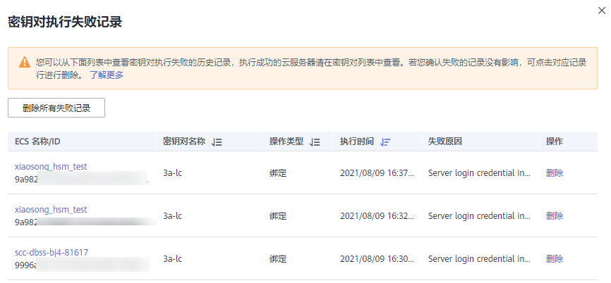
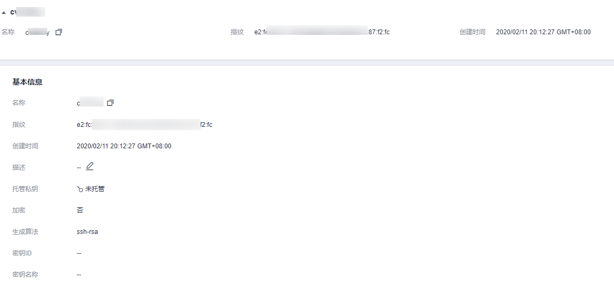

# 查看密钥对

该任务指导用户通过密钥对管理界面查看密钥对的信息，包括密钥对的“名称“、“指纹“、“私钥“和“使用数量“。

## 前提条件

已获取管理控制台的登录帐号与密码。

## 操作步骤

1.  登录管理控制台。
2.  单击管理控制台左上角，选择区域或项目。
3.  单击页面上方的“服务列表“，选择“安全  \>  数据加密服务“，默认进入数据加密服务的“密钥管理“界面。

1.  在左侧导航树中，选择“密钥对管理“，进入“密钥对列表“页面。

1.  在密钥对列表中查看密钥对的信息，用户可在右上角的搜索框中输入密钥对的名称，单击，搜索需要查看的密钥对。

    > **说明：**   
    >密钥对列表中包含创建和导入的密钥对的“名称“、“指纹“、“私钥“以及“使用数量“。  

    **图 1**  密钥对列表  
    

2.  可单击密钥对列表上方的，查看密钥对执行失败记录，如[图2](#fig688517423012)所示。

    > **说明：**   
    >密钥对执行重置或者替换的状态：  
    >：正在执行  
    >：执行失败  

    **图 2**  密钥对执行失败记录  
    

    > **说明：**   
    >用户可单击指定密钥对执行失败记录所在行的“删除“，删除失败记录；或者单击“删除所有失败记录“，删除所有的失败记录。  

3.  单击目标密钥对的名称，显示密钥对详细信息以及使用该密钥对的弹性云服务器列表，如[图3](#fig99418471135)所示。

    **图 3**  密钥对详细信息  
    

    > **说明：**   
    >当用户购买弹性云服务器，选择的是使用“密钥对方式“登录时，购买成功后，选择的密钥对即与弹性云服务器绑定。  

    绑定密钥对的弹性云服务器，参数说明如[表1](#table92625287420)所示。

    **表 1**  弹性云服务器参数说明

    
    <table><thead align="left"><tr id="row17262228244"><th class="cellrowborder" valign="top" width="32%" id="mcps1.2.3.1.1">
参数名

    </th>
    <th class="cellrowborder" valign="top" width="68%" id="mcps1.2.3.1.2">
参数说明

    </th>
    </tr>
    </thead>
    <tbody><tr id="row326212285418"><td class="cellrowborder" valign="top" width="32%" headers="mcps1.2.3.1.1 ">
ECS 名称/ID

    </td>
    <td class="cellrowborder" valign="top" width="68%" headers="mcps1.2.3.1.2 ">
弹性云服务器的名称与ID。

    </td>
    </tr>
    <tr id="row102641628744"><td class="cellrowborder" valign="top" width="32%" headers="mcps1.2.3.1.1 ">
状态

    </td>
    <td class="cellrowborder" valign="top" width="68%" headers="mcps1.2.3.1.2 ">
弹性云服务器的状态：

    <ul id="ul10721135812019"><li>运行中</li><li>创建中</li><li>故障</li><li>关机</li><li>DELETE</li><li>HARD_REBOOT</li><li>MIGRATING</li><li>REBOOT</li><li>RESIZE</li><li>REVERT_RESIZE</li><li>SHELVED</li><li>SHELVED_OFF</li><li>LOADED</li><li>UNKNOWN</li><li>VERIFY_RESIZE</li></ul>
    </td>
    </tr>
    <tr id="row92644283416"><td class="cellrowborder" valign="top" width="32%" headers="mcps1.2.3.1.1 ">
私有IP地址

    </td>
    <td class="cellrowborder" valign="top" width="68%" headers="mcps1.2.3.1.2 ">
私有IP地址。

    </td>
    </tr>
    <tr id="row192641328240"><td class="cellrowborder" valign="top" width="32%" headers="mcps1.2.3.1.1 ">
弹性IP

    </td>
    <td class="cellrowborder" valign="top" width="68%" headers="mcps1.2.3.1.2 ">
弹性IP地址。

    </td>
    </tr>
    <tr id="row12641928743"><td class="cellrowborder" valign="top" width="32%" headers="mcps1.2.3.1.1 ">
绑定密钥对

    </td>
    <td class="cellrowborder" valign="top" width="68%" headers="mcps1.2.3.1.2 ">
绑定弹性云服务器的密钥对。

    </td>
    </tr>
    </tbody>
    </table>

