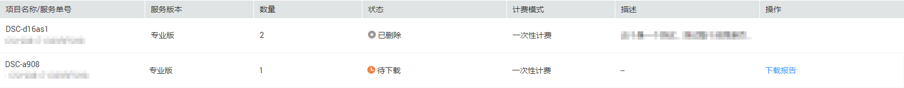

# 查看服务项目列表

1.  [登录管理控制台](https://console.huaweicloud.com)。
2.  单击管理控制台左上角，选择区域或项目。
3.  单击，选择“安全  \>  数据加密服务“，默认进入数据加密服务的“密钥管理“界面。
4.  单击“数据安全治理”进入实例列表页面。
5.  查看实例列表，如[图1](#fig41426895515)所示，各参数说明如[表1](#table1167212465614)所示。

    **图 1**  实例列表  
    

    **表 1**  实例列表参数说明

    
    <table><thead align="left"><tr id="row76735247566"><th class="cellrowborder" valign="top" width="50%" id="mcps1.2.3.1.1">
参数名称

    </th>
    <th class="cellrowborder" valign="top" width="50%" id="mcps1.2.3.1.2">
说明

    </th>
    </tr>
    </thead>
    <tbody><tr id="row4673122414561"><td class="cellrowborder" valign="top" width="50%" headers="mcps1.2.3.1.1 ">
项目名称/服务单号

    </td>
    <td class="cellrowborder" valign="top" width="50%" headers="mcps1.2.3.1.2 ">
单击可修改项目名称。

    </td>
    </tr>
    <tr id="row1867319244561"><td class="cellrowborder" valign="top" width="50%" headers="mcps1.2.3.1.1 ">
服务版本

    </td>
    <td class="cellrowborder" valign="top" width="50%" headers="mcps1.2.3.1.2 ">
包含专业版和企业版。

    </td>
    </tr>
    <tr id="row15673142412563"><td class="cellrowborder" valign="top" width="50%" headers="mcps1.2.3.1.1 ">
数量

    </td>
    <td class="cellrowborder" valign="top" width="50%" headers="mcps1.2.3.1.2 ">
购买的数量。

    </td>
    </tr>
    <tr id="row1267362445613"><td class="cellrowborder" valign="top" width="50%" headers="mcps1.2.3.1.1 ">
状态

    </td>
    <td class="cellrowborder" valign="top" width="50%" headers="mcps1.2.3.1.2 ">
包含如下状态：

    <ul id="ul12941918173311"><li>服务受理中</li><li>待验收</li><li>待下载</li><li>已完成</li><li>报告即将过期</li><li>已删除</li></ul>
    </td>
    </tr>
    <tr id="row15673124175615"><td class="cellrowborder" valign="top" width="50%" headers="mcps1.2.3.1.1 ">
计费模式

    </td>
    <td class="cellrowborder" valign="top" width="50%" headers="mcps1.2.3.1.2 ">
一次性计费。

    </td>
    </tr>
    <tr id="row99695111336"><td class="cellrowborder" valign="top" width="50%" headers="mcps1.2.3.1.1 ">
描述

    </td>
    <td class="cellrowborder" valign="top" width="50%" headers="mcps1.2.3.1.2 ">
-

    </td>
    </tr>
    <tr id="row1436410313310"><td class="cellrowborder" valign="top" width="50%" headers="mcps1.2.3.1.1 ">
操作

    </td>
    <td class="cellrowborder" valign="top" width="50%" headers="mcps1.2.3.1.2 ">
<a href="下载报告和确认验收.md">下载报告</a>。

    </td>
    </tr>
    </tbody>
    </table>

