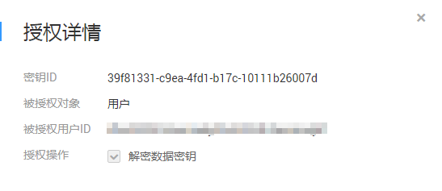

# 查询授权

该任务指导用户通过KMS界面查看自定义密钥的授权信息，包括授权ID、被授权ID、授权操作、创建时间等。

## 前提条件

用户已创建授权。

## 操作步骤

1.  [登录管理控制台](https://console.huaweicloud.com)。
2.  单击管理控制台左上角，选择区域或项目。
3.  单击页面左侧，选择“安全与合规  \>  数据加密服务“，默认进入“密钥管理“界面。
4.  单击目标自定义密钥的别名，进入密钥详细信息页面。
5.  单击“授权“，用户可查看当前自定义密钥的授权信息。自定义密钥的授权信息如[表1](#t0484dc5b4d9e4d86a61df05bffcaecf3)所示。

    **表 1**  授权信息参数说明

    
    <table><thead align="left"><tr id="r344dbb44a66149b3a750942f4f90153d"><th class="cellrowborder" valign="top" width="21.43%" id="mcps1.2.3.1.1">
参数

    </th>
    <th class="cellrowborder" valign="top" width="78.57%" id="mcps1.2.3.1.2">
参数说明

    </th>
    </tr>
    </thead>
    <tbody><tr id="row152631141414"><td class="cellrowborder" valign="top" width="21.43%" headers="mcps1.2.3.1.1 ">
授权名称

    </td>
    <td class="cellrowborder" valign="top" width="78.57%" headers="mcps1.2.3.1.2 ">
创建授权时为授权进行命名。

    </td>
    </tr>
    <tr id="r40189b0e279a45b8b9cdc68f376692c7"><td class="cellrowborder" valign="top" width="21.43%" headers="mcps1.2.3.1.1 ">
授权ID

    </td>
    <td class="cellrowborder" valign="top" width="78.57%" headers="mcps1.2.3.1.2 ">
随机生成的授权的唯一标识。

    </td>
    </tr>
    <tr id="row59171317172"><td class="cellrowborder" valign="top" width="21.43%" headers="mcps1.2.3.1.1 ">
授权类型

    </td>
    <td class="cellrowborder" valign="top" width="78.57%" headers="mcps1.2.3.1.2 ">
授权类型：用户和帐号。

    </td>
    </tr>
    <tr id="re18421f3a01241f49fbbe726f0c01d09"><td class="cellrowborder" valign="top" width="21.43%" headers="mcps1.2.3.1.1 ">
被授权ID

    </td>
    <td class="cellrowborder" valign="top" width="78.57%" headers="mcps1.2.3.1.2 ">
被授权的ID。

    </td>
    </tr>
    <tr id="r7b0ddb2c41d7426db24e4abeff60fb95"><td class="cellrowborder" valign="top" width="21.43%" headers="mcps1.2.3.1.1 ">
授权操作

    </td>
    <td class="cellrowborder" valign="top" width="78.57%" headers="mcps1.2.3.1.2 ">
被授予用户对自定义密钥的操作权限（例如：创建数据密钥）。

    </td>
    </tr>
    <tr id="r46593d24fa0440b394527c8b5a2c3806"><td class="cellrowborder" valign="top" width="21.43%" headers="mcps1.2.3.1.1 ">
创建时间

    </td>
    <td class="cellrowborder" valign="top" width="78.57%" headers="mcps1.2.3.1.2 ">
创建该授权的时间。

    </td>
    </tr>
    <tr id="row798882601710"><td class="cellrowborder" valign="top" width="21.43%" headers="mcps1.2.3.1.1 ">
操作

    </td>
    <td class="cellrowborder" valign="top" width="78.57%" headers="mcps1.2.3.1.2 ">
用户可以在操作栏中，执行撤销授权操作。

    </td>
    </tr>
    </tbody>
    </table>

6.  勾选目标授权，单击右下图标，可查看授权详情，如[图 授权详情](#fig87319206391)所示。

    **图 1**  授权详情  
    

