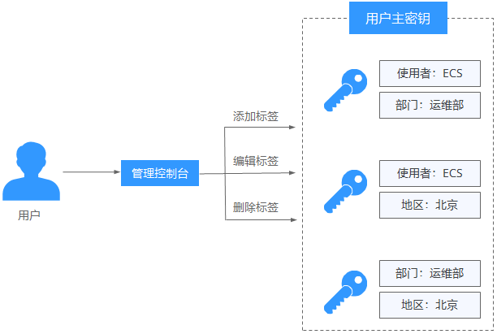

# 标签概述

## 操作场景

标签是数据加密服务的标识。为数据加密服务添加标签，可以方便用户识别和管理拥有的数据加密资源。

您可以在创建资源时添加标签，也可以在资源创建完成后，在云资源的详情页添加标签。

用户可以按照部门、使用者角色等为密钥添加标签，例如，部门：运维部，如[图 管理标签](#fig168977138111)所示。

**图 1**  管理标签  

## 标签命名规则

-   每个标签由一对键值对（Key-Value）组成。
-   每个数据加密服务资源最多可以添加20个标签。
-   对于每个资源，每个标签键（Key）都必须是唯一的，每个标签键（Key）只能有一个值（Value）。
-   标签共由两部分组成：“标签键”和“标签值”，其中，“标签键”和“标签值”的命名规则如[表 标签参数说明](#table41809200275)所示。

    **表 1**  标签参数说明

    
    <table><thead align="left"><tr id="row1718110201279"><th class="cellrowborder" valign="top" width="33.33333333333333%" id="mcps1.2.4.1.1">
参数

    </th>
    <th class="cellrowborder" valign="top" width="33.33333333333333%" id="mcps1.2.4.1.2">
规则

    </th>
    <th class="cellrowborder" valign="top" width="33.33333333333333%" id="mcps1.2.4.1.3">
样例

    </th>
    </tr>
    </thead>
    <tbody><tr id="row918118208275"><td class="cellrowborder" valign="top" width="33.33333333333333%" headers="mcps1.2.4.1.1 ">
标签键

    </td>
    <td class="cellrowborder" valign="top" width="33.33333333333333%" headers="mcps1.2.4.1.2 "><ul id="u6541ee1746d64f3e80b05bdbba1010f5"><li>必填。</li><li>对于同一个自定义密钥，标签键唯一。</li><li>长度不超过128个字符。</li><li>首尾不能包含空格。</li><li>不能以_sys_开头。</li><li>可以包含以下字符：<ul id="ul126881015191010"><li>中文</li><li>英文</li><li>数字</li><li>空格</li><li>特殊字符 “_”、“.”、“：”、“/”、“=”、“+”、</li></ul>
    </li></ul>
    </td>
    <td class="cellrowborder" valign="top" width="33.33333333333333%" headers="mcps1.2.4.1.3 ">
cost

    </td>
    </tr>
    <tr id="row13642893114"><td class="cellrowborder" valign="top" width="33.33333333333333%" headers="mcps1.2.4.1.1 ">
标签值

    </td>
    <td class="cellrowborder" valign="top" width="33.33333333333333%" headers="mcps1.2.4.1.2 "><ul id="ue18a9cb3059e43c78ec77f2492539753"><li>可以为空。</li><li>长度不超过255个字符。</li><li>可以包含以下字符：<ul id="ul17891151414169"><li>中文</li><li>英文</li><li>数字</li><li>空格</li><li>特殊字符 “_”、“.”、“：”、“/”、“=”、“+”、“-”、“@”</li></ul>
    </li></ul>
    </td>
    <td class="cellrowborder" valign="top" width="33.33333333333333%" headers="mcps1.2.4.1.3 ">
100

    </td>
    </tr>
    </tbody>
    </table>

