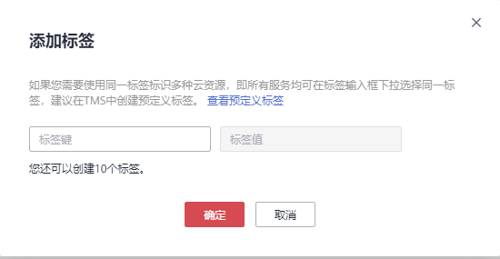

# 添加标签

标签用于标识凭据。为凭据添加标签，可以方便用户对凭据进行分类和跟踪。

## 前提条件

已获取管理控制台的登录帐号与密码。

## 操作步骤

1.  [登录管理控制台](https://console.huaweicloud.com)。
2.  单击管理控制台左上角，选择区域或项目。
3.  单击页面左侧，选择“安全与合规  \>  数据加密服务“，默认进入“密钥管理“界面。
4.  在左侧导航树中，选择“凭据管理“，进入“凭据管理“页面。
5.  单击凭据名称，进入凭据详细信息页面。
6.  在“标签“区，单击“添加标签“，弹出添加标签对话框，如[图1](#ff809bb6d608c464aa1430d54c02b19be)所示，在弹出的“添加标签“对话框中输入“标签键“和“标签值“，参数说明如[表1](#t2276fe27aa3d4e03a154c9332ff563f6)所示。

    **图 1**  添加标签  
    

    > **说明：** 
    >-   若需要使用同一标签标识多种云资源，即所有服务均可在标签输入框下选择同一标签，用户可在TMS中创建预定义标签。更多关于预定义标签的信息，请参见《标签管理用户指南》。
    >-   当同时添加多个标签，需要删除其中一个待添加的标签时，可单击该标签所在行的“删除“，删除标签。

    **表 1**  标签参数说明

    
    <table><thead align="left"><tr id="r89466a68d27d4826982e0c32f41ba194"><th class="cellrowborder" valign="top" width="13.41134113411341%" id="mcps1.2.4.1.1">
参数

    </th>
    <th class="cellrowborder" valign="top" width="48.784878487848786%" id="mcps1.2.4.1.2">
参数说明

    </th>
    <th class="cellrowborder" valign="top" width="37.80378037803781%" id="mcps1.2.4.1.3">
取值要求

    </th>
    </tr>
    </thead>
    <tbody><tr id="r038b16919f2749e1a79c9146dcd61ecb"><td class="cellrowborder" valign="top" width="13.41134113411341%" headers="mcps1.2.4.1.1 ">
标签键

    </td>
    <td class="cellrowborder" valign="top" width="48.784878487848786%" headers="mcps1.2.4.1.2 ">
标签的名称。

    
同一个凭据，一个标签键只能对应一个标签值；不同的凭据可以使用相同的标签键。

    
用户最多可以给单个凭据添加10个标签。

    </td>
    <td class="cellrowborder" valign="top" width="37.80378037803781%" headers="mcps1.2.4.1.3 "><ul id="u6541ee1746d64f3e80b05bdbba1010f5"><li>必填。</li><li>对于同一个凭据，标签键唯一。</li><li>长度不超过36个字符。</li><li>可以包含以下5种字符：<ul id="u9ac0facd1f3d42699bd0291c01b5a6d2"><li>大写字母</li><li>小写字母</li><li>数字</li><li>特殊字符，包括“-”和“_”</li><li>中文字符</li></ul>
    </li></ul>
    </td>
    </tr>
    <tr id="r7132d5376e104100a78e4f668f6eae34"><td class="cellrowborder" valign="top" width="13.41134113411341%" headers="mcps1.2.4.1.1 ">
标签值

    </td>
    <td class="cellrowborder" valign="top" width="48.784878487848786%" headers="mcps1.2.4.1.2 ">
标签的值。

    </td>
    <td class="cellrowborder" valign="top" width="37.80378037803781%" headers="mcps1.2.4.1.3 "><ul id="ue18a9cb3059e43c78ec77f2492539753"><li>可以为空。</li><li>长度不超过43个字符。</li><li>可以包含以下5种字符：<ul id="u9f6235add32c4348b93d0f8175544b4b"><li>大写字母</li><li>小写字母</li><li>数字</li><li>特殊字符，包括“-”和“_”</li><li>中文字符</li></ul>
    </li></ul>
    </td>
    </tr>
    </tbody>
    </table>

7.  单击“确定“，完成标签的添加。

