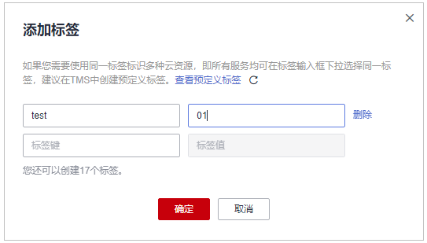

# 添加标签

标签用于标识密钥管理或用户主密钥。为密钥管理或用户主密钥添加标签，可以方便用户对密钥管理或用户主密钥进行分类和跟踪，并按标签汇总密钥管理或用户主密钥的使用情况。

用户可以按照部门、使用者角色等为密钥添加标签，例如，部门：运维部，如[图1](#fig1082116371457)所示。

> **注意：**   
>KMS不支持为默认主密钥添加标签。  

**图 1**  管理标签  

## 前提条件

已获取管理控制台的登录帐号与密码。

## 添加标签

1.  登录管理控制台。
2.  单击管理控制台左上角，选择区域或项目。
3.  单击页面上方的“服务列表“，选择“安全  \>  数据加密服务“，默认进入数据加密服务的“密钥管理“界面。
4.  单击目标密钥管理所在行，展开密钥管理。
5.  单击目标用户主密钥的别名，进入密钥详细信息页面。

    > **说明：**   
    >若用户需要为密钥管理添加标签，可直接单击密钥管理的名称，进入密钥管理详细信息页面，单击“添加标签“，添加标签。  

6.  单击“标签“，进入标签管理页面，如[图2](#ff11132284da543c287ffa43f1b232c92)所示。

    **图 2**  标签页面  
    

7.  单击“添加标签“，弹出添加标签对话框，如[图3](#ff809bb6d608c464aa1430d54c02b19be)所示。

    **图 3**  添加标签  
    

    > **说明：**   
    >-   若需要使用同一标签标识多种云资源，即所有服务均可在标签输入框下选择同一标签，用户可在TMS中创建预定义标签。更多关于预定义标签的信息，请参见《标签管理用户指南》。  
    >-   当同时添加多个标签，需要删除其中一个待添加的标签时，可单击该标签所在行的“删除“，删除标签。  

8.  在弹出的“添加标签“对话框中输入“标签键“和“标签值“，参数说明如[表1](#t2276fe27aa3d4e03a154c9332ff563f6)所示。

    **表 1**  标签参数说明

    
    <table><thead align="left"><tr id="r89466a68d27d4826982e0c32f41ba194"><th class="cellrowborder" valign="top" width="11%" id="mcps1.2.5.1.1">
参数

    </th>
    <th class="cellrowborder" valign="top" width="40%" id="mcps1.2.5.1.2">
参数说明

    </th>
    <th class="cellrowborder" valign="top" width="31%" id="mcps1.2.5.1.3">
取值要求

    </th>
    <th class="cellrowborder" valign="top" width="18%" id="mcps1.2.5.1.4">
样例

    </th>
    </tr>
    </thead>
    <tbody><tr id="r038b16919f2749e1a79c9146dcd61ecb"><td class="cellrowborder" valign="top" width="11%" headers="mcps1.2.5.1.1 ">
标签键

    </td>
    <td class="cellrowborder" valign="top" width="40%" headers="mcps1.2.5.1.2 ">
标签的名称。

    
同一个用户主密钥下，一个标签键只能对应一个标签值；不同的用户主密钥下可以使用相同的标签键。

    
用户最多可以给单个用户主密钥添加10个标签。

    </td>
    <td class="cellrowborder" valign="top" width="31%" headers="mcps1.2.5.1.3 "><ul id="u6541ee1746d64f3e80b05bdbba1010f5"><li>必填。</li><li>对于同一个用户主密钥，标签键唯一。</li><li>长度不超过36个字符。</li><li>只能包含以下4种字符：<ul id="u9ac0facd1f3d42699bd0291c01b5a6d2"><li>大写字母</li><li>小写字母</li><li>数字</li><li>特殊字符，包括“-”和“_”</li></ul>
    </li></ul>
    </td>
    <td class="cellrowborder" valign="top" width="18%" headers="mcps1.2.5.1.4 ">
cost

    </td>
    </tr>
    <tr id="r7132d5376e104100a78e4f668f6eae34"><td class="cellrowborder" valign="top" width="11%" headers="mcps1.2.5.1.1 ">
标签值

    </td>
    <td class="cellrowborder" valign="top" width="40%" headers="mcps1.2.5.1.2 ">
标签的值。

    </td>
    <td class="cellrowborder" valign="top" width="31%" headers="mcps1.2.5.1.3 "><ul id="ue18a9cb3059e43c78ec77f2492539753"><li>可以为空。</li><li>长度不超过43个字符。</li><li>只能包含以下4种字符：<ul id="u9f6235add32c4348b93d0f8175544b4b"><li>大写字母</li><li>小写字母</li><li>数字</li><li>特殊字符，包括“-”和“_”</li></ul>
    </li></ul>
    </td>
    <td class="cellrowborder" valign="top" width="18%" headers="mcps1.2.5.1.4 ">
100

    </td>
    </tr>
    </tbody>
    </table>

9.  单击“确定“，完成标签的添加。

