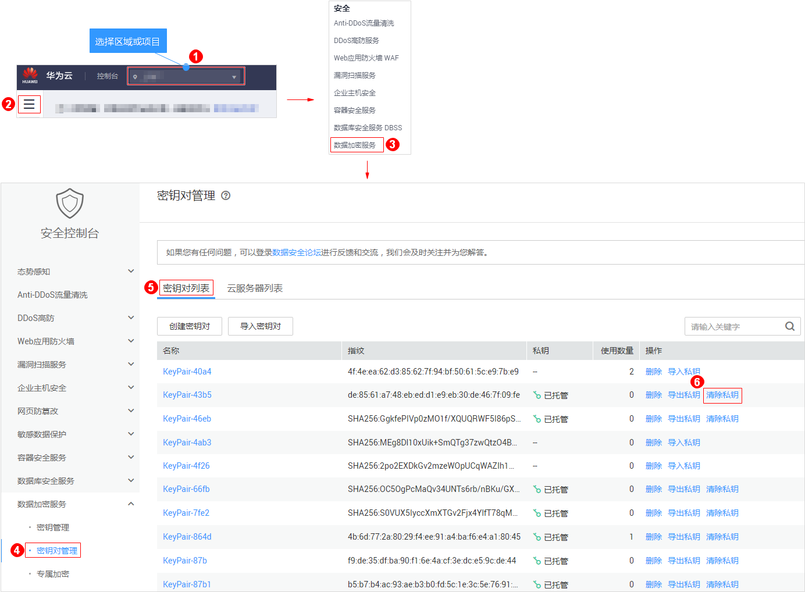

# 清除私钥

若用户不需要使用托管在管理控制台的私钥时，可通过“密钥对管理“界面将托管的私钥清除。

## 前提条件

已将私钥托管在管理控制台。

## 删除私钥

1.  [登录管理控制台](https://console.huaweicloud.com)。
2.  单击目标公钥所在行的“清除私钥“。

    **图 1**  清除私钥  
    

3.  在弹出的“清除私钥“对话框中，单击“确定“，清除私钥。

    > **说明：**   
    >清除私钥后，用户无法再从华为云获取私钥，请谨慎操作。若需要再次托管私钥，可将私钥再导入管理控制台。  

