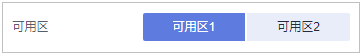
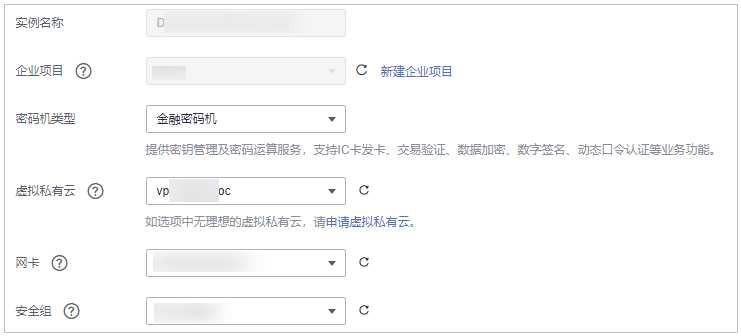

# 激活专属加密实例

您需要激活专属加密实例才能使用。激活时需要支付专属加密实例的包周期费用。基础版的激活费用为零。

该任务指导用户通过专属加密界面激活专属加密实例。

## 前提条件

-   已获取管理控制台的登录帐号与密码。
-   专属加密实例的状态为“待激活“。

## 操作步骤

1.  [登录管理控制台](https://console.huaweicloud.com)。
2.  单击目标专属加密实例所在行的“激活“。

    **图 1**  激活  
    

3.  选择“可用区“。

    **图 2**  选择可用区  
    

4.  填写实例化信息，如[图3](#fig155581141163114)所示。相关参数说明如[表1](#table15559184115318)所示。

    **图 3**  实例化专属加密实例  
    

    **表 1**  实例化参数说明

    
    <table><thead align="left"><tr id="row05581241173110"><th class="cellrowborder" valign="top" width="22.240000000000002%" id="mcps1.2.4.1.1">
参数名称

    </th>
    <th class="cellrowborder" valign="top" width="59.28000000000001%" id="mcps1.2.4.1.2">
说明

    </th>
    <th class="cellrowborder" valign="top" width="18.48%" id="mcps1.2.4.1.3">
取值样例

    </th>
    </tr>
    </thead>
    <tbody><tr id="row8465114619366"><td class="cellrowborder" valign="top" width="22.240000000000002%" headers="mcps1.2.4.1.1 ">
实例名称

    </td>
    <td class="cellrowborder" valign="top" width="59.28000000000001%" headers="mcps1.2.4.1.2 ">
专属加密实例的名称。

    
 说明： 

实例名称只能由中文字符、英文字母、数字、下划线或者中划线组成。

    

    </td>
    <td class="cellrowborder" valign="top" width="18.48%" headers="mcps1.2.4.1.3 ">
DedicatedHSM-3c98-0002

    </td>
    </tr>
    <tr id="row843114319366"><td class="cellrowborder" valign="top" width="22.240000000000002%" headers="mcps1.2.4.1.1 ">
密码机类型

    </td>
    <td class="cellrowborder" valign="top" width="59.28000000000001%" headers="mcps1.2.4.1.2 ">
可选择的密码机类型，包含“金融密码机”、“服务器密码机”和“签名验证服务器”。

    <ul id="ul9805834142817"><li>金融密码机：提供密钥管理及密码运算服务，支持IC卡发卡、交易验证、数据加密、数字签名、动态口令认证等业务功能。</li><li>服务器密码机：提供安全完善的密钥管理服务，提供高性能的、多任务并行处理的数据签名/验签、数据加密/解密等密码运算服务。</li><li>签名验证服务器：通过数字签名、数字信封、数字摘要等密码技术手段，保障用户数据的完整性、机密性、抗抵赖性和事后追溯性。</li></ul>
    </td>
    <td class="cellrowborder" valign="top" width="18.48%" headers="mcps1.2.4.1.3 ">
金融密码机

    </td>
    </tr>
    <tr id="row19559164183112"><td class="cellrowborder" valign="top" width="22.240000000000002%" headers="mcps1.2.4.1.1 ">
虚拟私有云

    </td>
    <td class="cellrowborder" valign="top" width="59.28000000000001%" headers="mcps1.2.4.1.2 ">
可以选择使用已有的虚拟私有云（Virtual Private Cloud，VPC）网络，或者单击“申请虚拟私有云”创建新的虚拟私有云。

    
更多关于虚拟私有云的信息，请参见《虚拟私有云用户指南》。

    </td>
    <td class="cellrowborder" valign="top" width="18.48%" headers="mcps1.2.4.1.3 ">
vpc-test-dhsm

    </td>
    </tr>
    <tr id="row365115613503"><td class="cellrowborder" valign="top" width="22.240000000000002%" headers="mcps1.2.4.1.1 ">
网卡

    </td>
    <td class="cellrowborder" valign="top" width="59.28000000000001%" headers="mcps1.2.4.1.2 ">
界面显示所有可选择的子网，系统自动为专属加密实例分配3个未使用的IP地址。

    
 说明： 

每个专属加密实例会创建两个节点，用作访问后台加密机资源池；为了保障节点的高可用性，再给专属加密实例分配一个浮动IP。

    

    
更多关于子网的信息，请参见《虚拟私有云用户指南》。

    </td>
    <td class="cellrowborder" valign="top" width="18.48%" headers="mcps1.2.4.1.3 ">
subnet-test-dhsm（192.168.0.0/24）

    </td>
    </tr>
    <tr id="row1955914414311"><td class="cellrowborder" valign="top" width="22.240000000000002%" headers="mcps1.2.4.1.1 ">
安全组

    </td>
    <td class="cellrowborder" valign="top" width="59.28000000000001%" headers="mcps1.2.4.1.2 ">
界面显示专属加密实例已配置的安全组。选择专属加密实例的安全组后，该专属加密实例将受到该安全组访问规则的保护。

    
更多关于安全组的信息，请参见《虚拟私有云用户指南》。

    </td>
    <td class="cellrowborder" valign="top" width="18.48%" headers="mcps1.2.4.1.3 ">
WorkspaceUserSecurityGroup

    </td>
    </tr>
    </tbody>
    </table>

5.  若您购买的是“基础版“的专属加密实例：

    请单击“立即创建“，回到专属加密实例列表界面，可以查看激活的专属加密实例信息。

    当专属加密实例的“状态“为“创建中“时，表示专属加密实例激活成功。

6.  若您购买的是“专业版“的专属加密实例：
    1.  选择“购买时长“。

        可以选择1个月～1年的购买时长。

        > **说明：**   
        >勾选“自动续费“后，当服务期满时，系统会自动按照购买周期进行续费。  

    2.  确认当前配置无误后，单击“立即购买“。

        如果您对价格有疑问，可以单击“了解计费详情“了解，了解产品价格。

    3.  在“订单详情“页面，确认订单详情，阅读并勾选“我已阅读并同意《隐私政策声明》“。
    4.  单击“去支付“，支付包周期费用。
    5.  在“付款“页面，选择付款方式进行付款。

        成功付款后，在专属加密实例列表界面，可以查看激活的专属加密实例信息。

        当专属加密实例的“状态“为“创建中“时，表示专属加密实例已完成激活，系统正在分配专属加密实例给用户，等待5-10分钟，可分配完成。

        创建中：系统正在分配专属加密实例给用户，等待5-10分钟，可分配完成。

        分配后，分配状态有以下两种情况：

        -   创建失败：资源不够或网络故障等原因可能导致创建专属加密实例失败。

            > **说明：**   
            >若创建专属加密实例失败，您可以单击该专属加密实例所在行的“删除“，删除专属加密实例，并以工单的形式申请退款。  

        -   运行中：系统给用户分配专属加密实例已完成，专属加密实例处于“运行中“。

            > **说明：**   
            >成功创建专属加密实例后，不支持切换密码机类型，也不支持退订。如果您想切换密码机类型，需要重新购买。  

