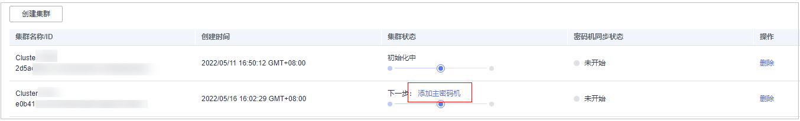
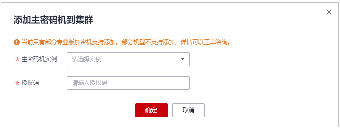

# 激活集群

## 前提条件

-   已创建专属加密集群。
-   已对专属加密实例进行初始化。

## 操作步骤

1.  [登录管理控制台](https://console.huaweicloud.com)。
2.  单击管理控制台左上角，选择区域或项目。
3.  单击页面左侧，选择“安全与合规  \>  数据加密服务“，默认进入“密钥管理“界面。
4.  在左侧导航树中，选择“专属加密 \> 集群列表“，进入“集群列表“页面。
5.  添加主密码机。在需激活的集群所在行的“集群状态“列中，单击“添加主密码机“，如[图 添加主密码机](#fig168217459169)所示。

    **图 1**  添加主密码机  
    

    > **说明：** 
    >主密码机需使用初始化软件进行初始化后，才可被添加。

6.  填写密码机参数，参数说明如[表 添加密码机参数配置说明](#table943610227534)所示，点击“确认“，“集群状态“列显示“初始化中“。

    **图 2**  添加主密码机到集群  
    

    **表 1**  添加密码机参数配置说明

    
    <table><thead align="left"><tr id="row2436122105312"><th class="cellrowborder" valign="top" width="50%" id="mcps1.2.3.1.1">
参数名称

    </th>
    <th class="cellrowborder" valign="top" width="50%" id="mcps1.2.3.1.2">
参数说明

    </th>
    </tr>
    </thead>
    <tbody><tr id="row13436192215539"><td class="cellrowborder" valign="top" width="50%" headers="mcps1.2.3.1.1 ">
主密码机实例

    </td>
    <td class="cellrowborder" valign="top" width="50%" headers="mcps1.2.3.1.2 ">
选择主密码机实例的名称。

    </td>
    </tr>
    <tr id="row1243610229532"><td class="cellrowborder" valign="top" width="50%" headers="mcps1.2.3.1.1 ">
授权码

    </td>
    <td class="cellrowborder" valign="top" width="50%" headers="mcps1.2.3.1.2 ">
填写主密码机实例的授权码。

    </td>
    </tr>
    </tbody>
    </table>

7.  添加非主密码机。在已添加主密码机的集群所在行，“集群状态“列中，单击“添加非主密码机“，填写密码机参数。

    > **说明：** 
    >-   需完成添加主密码机和非主密码机才能激活集群。
    >-   “初始化中“状态约2-5分钟。
    >-   当前只支持添加部分加密机机型，详情支持工单咨询，提交工单请参见[提交工单](https://support.huaweicloud.com/usermanual-ticket/zh-cn_topic_0127038618.html)。

