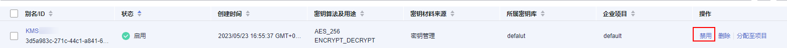

# 禁用密钥

该任务指导用户通过密钥管理界面对指定的用户主密钥进行禁用，以紧急保护数据。

用户主密钥被禁用后，用户将不能使用该密钥进行加解密任何数据。如果要使用该密钥进行加解密数据，用户需将该密钥重新启用，具体操作请参见[启用密钥](启用密钥.md)。

## 前提条件

-   已获取管理控制台的登录帐号与密码。
-   待禁用的密钥需处于“启用“状态。

## 约束条件

-   默认主密钥为密钥管理自动创建，不支持禁用操作。
-   密钥被禁用后，仍然会计费。只有删除密钥，才会停止计费。

## 操作步骤

1.  [登录管理控制台](https://console.huaweicloud.com)。
2.  单击管理控制台左上角，选择区域或项目。
3.  单击页面左侧，选择“安全与合规  \>  数据加密服务“，默认进入“密钥管理“界面。
4.  在需要禁用的密钥所在行，单击“禁用“。

    **图 1**  禁用单个密钥  
    

5.  在弹出窗口中，勾选“我已知晓禁用以上密钥产生的影响“，单击“是“，完成禁用单个密钥操作。

    > **说明：** 
    >如果您想批量禁用密钥，可以勾选所有需要禁用的密钥，然后在列表左上角，单击“禁用“。

