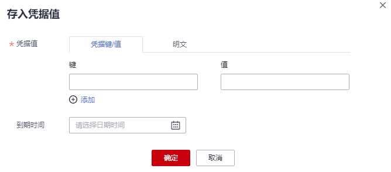
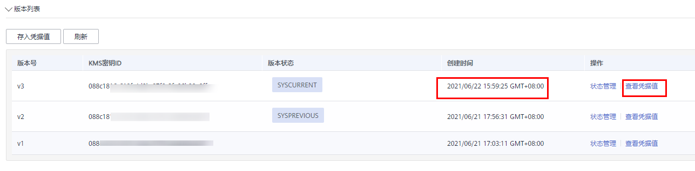

# 管理凭据值

该任务指导用户通过凭据管理界面存入凭据值和查看凭据值。

在目标凭据中，存入凭据值即创建一个新的凭据版本，用于加密保管新的凭据值。默认情况下，新创建的凭据版本被标记为“SYSCURRENT“状态，而“SYSCURRENT“标记的前一个凭据版本被标记为“SYSPREVIOUS“状态。

## 前提条件

已获取管理控制台的登录帐号与密码。

## 约束条件

-   凭据管理服务的每个凭据中最多可支持20个版本。
-   每次存入新的凭据值时，凭据版本号按照为v1，v2，v3...的模式自动增加。

## 操作步骤

1.  [登录管理控制台](https://console.huaweicloud.com)。
2.  单击管理控制台左上角，选择区域或项目。
3.  单击页面左侧，选择“安全与合规  \>  数据加密服务“，默认进入“密钥管理“界面。
4.  在左侧导航树中，选择“凭据管理“，进入“凭据管理“页面。
5.  单击凭据名称，进入凭据详细信息页面。

    **存入凭据值**

6.  在“版本列表“区，单击“存入凭据值“，弹出存入凭据值对话框，如[图1](#fig85981011175216)所示，在弹出的“存入凭据值“对话框中输入“凭据键/值“和“明文凭据“。

    **图 1**  存入凭据值  
    

7.  单击“确定“，在页面右上角弹出“版本凭据值添加成功“，则说明凭据值添加完成。

    在凭据版本列表查看最新凭据值。

    **查看凭据值**

8.  在“版本列表“区，单击目标凭据版本所在行的“查看凭据值“，如[图2](#fig12640530968)所示，弹出查看凭据值对话框。

    **图 2**  凭据版本列表  
    

9.  在“查看凭据值“对话框，单击“确定继续“。

    > **说明：** 
    >通常情况下，凭据值由应用程序调用API获取，如果您确实需要在服务控制台查看凭据值，请“确定继续“！

10. 查看凭据值，单击“确定“，关闭当前对话框。

