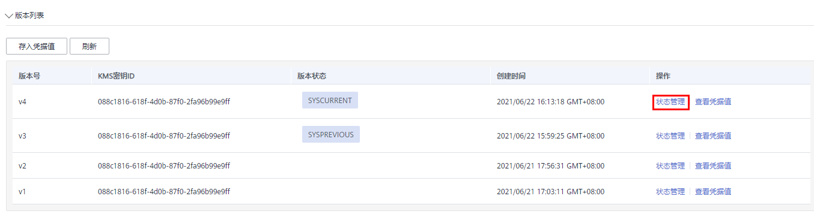
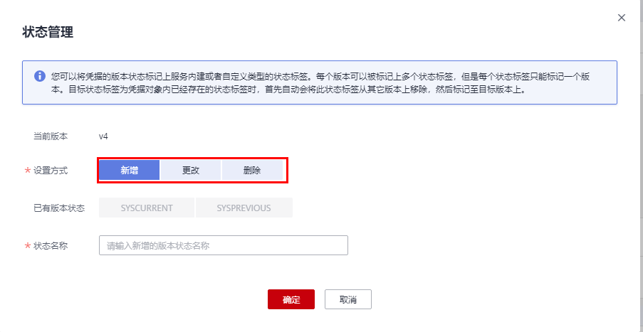

# 管理凭据版本状态

该任务指导用户通过凭据管理界面，进行新增、更改和删除凭据版本状态的操作。

凭据管理服务将凭据值加密后，存储在凭据对象下的版本中。每个版本可与多个凭据版本状态相关联，凭据版本状态用于标识凭据版本处于的阶段，没有版本状态标记的版本视为已弃用，可用凭据管理服务自动删除。

## 前提条件

已获取管理控制台的登录帐号与密码。

## 约束条件

-   初始版本的状态被标记为“SYSCURREN“T。
-   您可以将凭据的版本状态标记上服务内建或者自定义类型的状态标签。每个版本可以被标记上多个状态标签，但是每个状态标签只能标记一个版本。目标状态标签为凭据对象内已经存在的状态标签时，首先自动会将此状态标签从其它版本上移除，然后标记至目标版本上。
-   凭据管理服务的每个凭据中最多可支持12个凭据版本状态，每个凭据版本状态同时仅能标识一个凭据版本。
-   “SYSCURRENT“和“SYSPREVIOUS“为服务内建的凭据状态，不可删除。

## 操作步骤

1.  [登录管理控制台](https://console.huaweicloud.com)。
2.  单击管理控制台左上角，选择区域或项目。
3.  单击页面左侧，选择“安全与合规  \>  数据加密服务“，默认进入“密钥管理“界面。
4.  在左侧导航树中，选择“凭据管理“，进入“凭据管理“页面。
5.  单击凭据名称，进入凭据详细信息页面。
6.  在“版本列表“区，单击目标凭据版本所在行的“状态管理“。

    **图 1**  凭据版本列表  
    

7.  在“状态管理“对话框，用户可进行新增、更改、删除凭据版本状态的操作。

    **图 2**  状态管理  
    

    -   新增凭据版本状态

        在“状态管理“对话框，单击“新增“，填写“状态名称“。单击“确定“，完成凭据版本状态的新增。

        > **说明：** 
        >凭据管理服务的每个凭据中最多可支持12个凭据版本状态，每个凭据版本状态同时仅能标识一个凭据版本。

    -   更改凭据版本状态

        在“状态管理“对话框，单击“更改“，在“已有版本状态“选择目标版本状态。单击“确定“，完成凭据版本状态的更改。

    -   删除凭据版本状态

        在“状态管理“对话框，单击“删除“，在“当前版本状态“选择目标版本状态。单击“确定“，完成凭据版本状态的删除。

        > **说明：** 
        >“SYSCURRENT“和“SYSPREVIOUS“为服务内建的凭据状态，不可删除。

