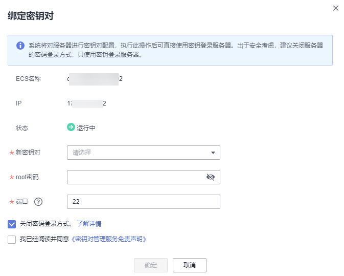

# 绑定密钥对<a name="dew_01_0071"></a>

当用户购买Linux操作系统的弹性云服务器使用的是“密码方式“登录弹性云服务器时，若用户需要将“密码方式“修改为“密钥对方式“，可通过管理控制台绑定密钥对，KPS将使用密钥对配置弹性云服务器。绑定完成后，用户可直接使用对应的私钥登录该弹性云服务器。

该任务指导用户通过密钥对管理界面绑定密钥对。

> **注意：**   
>在管理控制台上，不支持对Windows操作系统的弹性云服务器进行密钥对的绑定操作。  

## 前提条件<a name="section1264994613227"></a>

-   已获取管理控制台的登录帐号与密码。
-   弹性云服务器的状态处于“运行中“或者“关机“状态。

## 绑定密钥对<a name="section1830585320269"></a>

1.  登录管理控制台。
2.  单击管理控制台左上角，选择区域或项目。
3.  单击页面上方的“服务列表“，选择“安全  \>  数据加密服务“，默认进入数据加密服务的“密钥管理“界面。
4.  在左侧导航树中，选择“密钥对管理“，进入“密钥对列表“页面。

    > **说明：**   
    >用户也可以在“密钥对列表“页面，找到密钥对所对应的弹性云服务器，单击弹性云服务器所在行的“绑定“，绑定密钥对。  

5.  单击“云服务器列表“，显示云服务器列表页面，如[图1](#fig1682318516365)所示。

    **图 1**  弹性云服务器列表<a name="fig1682318516365"></a>  
    

6.  单击目标虚拟机所在行的“绑定“，弹出绑定密钥对的对话框。
    -   若弹性云服务器处于“关机“状态，绑定密钥对的对话框，如[图2](#fig1494316103396)所示。

        **图 2**  绑定密钥对（一）<a name="fig1494316103396"></a>  
        


    -   若弹性云服务器处于“运行中“状态，需要提供“root密码“，如[图3](#fig864112595411)所示。

        **图 3**  绑定密钥对（二）<a name="fig864112595411"></a>  
        

        > **说明：**   
        >-   若用户已有弹性云服务器的“root密码“，可直接输入root密码，直接进行密钥对绑定操作。  
        >-   若用户没有弹性云服务器的“root密码“，可将弹性云服务器关机，在弹性云服务器关机状态执行密钥对绑定操作。  


7.  在“新密钥对“下拉列表中，选择新的密钥对。
8.  用户可根据自己的需要选择是否勾选“关闭密码登录方式“，默认勾选“关闭密码登录方式“。

    > **说明：**   
    >若不关闭密码登录方式，用户既可使用密码登录弹性云服务器，也可以使用密钥对登录弹性云服务器。  
    >若关闭了密码登录方式，用户只能使用密钥对登录弹性云服务器，若用户仍然需要使用密码登录弹性云服务器，可再次开启密码登录方式，操作步骤如下所示：  
    >1.  登录弹性云服务器。  
    >2.  执行以下命令，打开**“/etc/ssh/sshd\_config“**文件。  
    >    **vi /etc/ssh/sshd\_config**  
    >3.  按“i“进入编辑模式，开启密码登录。  
    >    -   非SUSE操作系统，将“PasswordAuthentication“字段值修改为“yes“。  
    >        ```  
    >        PasswordAuthentication yes  
    >        ```  
    >    -   SUSE操作系统，将“PasswordAuthentication“和“UsePAM“字段值修改为“yes“。  
    >        ```  
    >        PasswordAuthentication yes  
    >        UsePAM yes  
    >        ```  
    >4.  按“Esc“，退出编辑模式。  
    >5.  输入“:wq“，按“Enter“，保存退出。  
    >6.  执行以下命令，重启SSH服务，使配置生效。  
    >    -   非_Ubuntu14.xx_版本的操作系统。  
    >        **service sshd restart**  
    >    -   _Ubuntu14.xx_版本的操作系统。  
    >        **service ssh restart**  

9.  请确认并勾选“该服务器使用华为云提供的公共镜像并未修改过SSH配置“。
10. 请阅读并勾选“我已阅读并同意《密钥对管理服务免责声明》“。
11. 单击“确定“，完成密钥对绑定操作。
    -   若在弹性云服务器处于非关机状态，直接使用“root密码“方式绑定密钥对，等待约30秒可绑定成功。
    -   若在弹性云服务器处于“关机“状态绑定密钥对，等待约5分钟可绑定成功。


