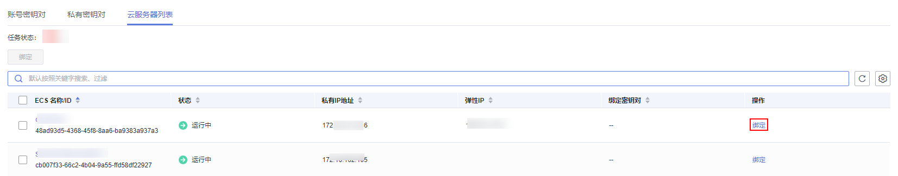

# 绑定密钥对

当用户购买Linux操作系统的弹性云服务器使用的是“密码方式“登录弹性云服务器时，若用户需要将“密码方式“修改为“密钥对方式“，可通过管理控制台绑定密钥对，KPS将使用密钥对配置弹性云服务器。绑定完成后，用户可直接使用对应的私钥登录该弹性云服务器。

该任务指导用户通过密钥对管理界面绑定密钥对。

## 前提条件

-   弹性云服务器的状态处于“运行中“或者“关机“状态。
-   弹性云服务器未绑定密钥对。
-   待重置密钥对的弹性云服务器使用的是华为云提供的公共镜像。
-   执行密钥对绑定操作是通过修改服务器的“/root/.ssh/authorized\_keys“文件的方式来写入用户公钥。请确保重置密钥对前，该文件没有被修改过，否则，绑定密钥对会失败。

## 约束条件

-   在管理控制台上，不支持对Windows操作系统的弹性云服务器进行密钥对的绑定操作。
-   公共镜像上，不支持CoreOS、OpenEuler、FreeBSD（Other）、Kylin V10 64bit和UnionTech OS Server 20 Euler 64bit系统进行密钥对的绑定绑定操作。

## 绑定密钥对

1.  [登录管理控制台](https://console.huaweicloud.com)。
2.  单击管理控制台左上角，选择区域或项目。
3.  单击页面左侧，选择“安全与合规  \>  数据加密服务“，默认进入“密钥管理“界面。
4.  在左侧导航树中，选择“密钥对管理“，进入“密钥对管理“页面。
5.  单击“云服务器列表“，显示云服务器列表页面，如[图1](#fig1682318516365)所示。

    **图 1**  绑定  
    

6.  单击目标虚拟机所在行的“绑定“，弹出“绑定密钥对“对话框。
    -   若弹性云服务器处于“关机“状态，绑定密钥对的对话框，如[图2](#fig1494316103396)所示。

        **图 2**  绑定密钥对（一）  
        

    -   若弹性云服务器处于“运行中“状态，需要提供“root密码“，如[图3](#fig864112595411)所示。

        **图 3**  绑定密钥对（二）  
        

        > **说明：** 
        >-   若用户已有弹性云服务器的“root密码“，可直接输入root密码，直接进行密钥对绑定操作。
        >-   若用户没有弹性云服务器的“root密码“，可将弹性云服务器关机，在弹性云服务器关机状态执行密钥对绑定操作。

7.  在“新密钥对“下拉列表中，选择新的密钥对。
8.  用户可根据自己的需要选择是否勾选“关闭密码登录方式“，默认勾选“关闭密码登录方式“。

    > **说明：** 
    >-   若不关闭密码登录方式，用户既可使用密码登录弹性云服务器，也可以使用密钥对登录弹性云服务器。
    >-   若关闭了密码登录方式，用户只能使用密钥对登录弹性云服务器，若用户仍然需要使用密码登录弹性云服务器，可再次开启密码登录方式，具体操作请参见[关闭弹性云服务器的密码登录方式后如何重新开启？](https://support.huaweicloud.com/dew_faq/dew_01_0072.html)。

9.  请阅读并勾选“我已阅读并同意《密钥对管理服务免责声明》“。
10. 单击“确定“，完成密钥对绑定操作。
    -   若在弹性云服务器处于非关机状态，直接使用“root密码“方式绑定密钥对，等待约30秒可绑定成功。
    -   若在弹性云服务器处于“关机“状态绑定密钥对，等待约5分钟可绑定成功。

