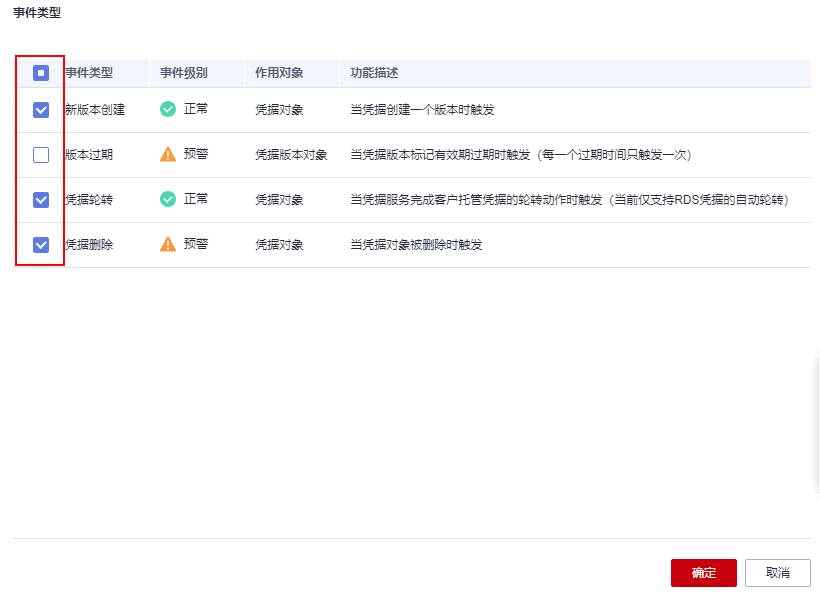

# 编辑事件

该任务指导用户通过事件通知页面对已创建事件类型进行修改。

## 操作步骤

1.  [登录管理控制台](https://console.huaweicloud.com)。
2.  单击管理控制台左上角，选择区域或项目。
3.  单击页面左侧，选择“安全与合规  \>  数据加密服务“，默认进入“密钥管理“界面。
4.  在左侧导航树中，选择“凭据管理“，单击“事件通知“，进入“事件通知“页面。
5.  单击需启用时间所在列的“编辑“，进入编辑事件界面。
6.  通过勾选目标事件类型修改已创建事件，如[图 编辑事件](#fig16497123004014)所示。

    **图 1**  编辑事件  
    

7.  单击“确定“，完成事件更新。

