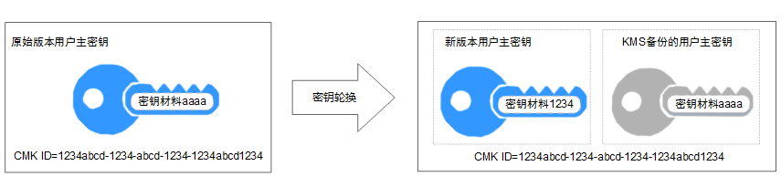

# 背景信息

广泛重复的使用加密密钥，会对加密密钥的安全造成风险。为了确保加密密钥的安全性，您需要为用户主密钥创建新的密钥材料。

您可以通过以下两种方式创建新的密钥材料。

-   手动轮换密钥

    您可以在KMS界面创建新的用户主密钥来代替原有的用户主密钥。

    > **说明：**   
    >若华为云服务（例如：OBS）使用KMS的用户主密钥加解密数据，需要手动轮换密钥时，用户需要在KMS界面创建一个新的用户主密钥，并在OBS界面将原用户主密钥替换为新的用户主密钥。  

-   自动轮换密钥

    > **说明：**   
    >仅专业版密钥管理支持自动轮换密钥，如果您需要使用该功能，请将密钥管理[升级到专业版](升级到专业版.md)。  

    为现有的用户主密钥开启密钥轮换，KMS自动为该用户主密钥生成新的密钥材料。

    密钥轮换只会更改用户主密钥的密钥材料，用户主密钥的属性（密钥ID、别名、描述、权限）不会发生变化。

    开启密钥轮换后，KMS会根据设置的轮换周期（默认365天）自动轮换密钥，每次轮换都会生成一个新版本的用户主密钥，如[图1](#fig9231144353)所示。

    **图 1**  密钥轮换工作原理  
    

    KMS会保留与该用户主密钥关联的所有版本的用户主密钥。这使得KMS可以解密使用该用户主密钥加密的任何密文。

    -   加密数据时，KMS会自动使用当前最新版本的用户主密钥来执行加密操作。
    -   解密数据时，KMS会自动使用加密时所使用的用户主密钥来执行解密操作。

    **表 1**  自动轮换密钥的工作方式

    
    <table><thead align="left"><tr id="row3231184420513"><th class="cellrowborder" valign="top" width="24.08%" id="mcps1.2.3.1.1">
密钥的来源或状态

    </th>
    <th class="cellrowborder" valign="top" width="75.92%" id="mcps1.2.3.1.2">
是否可以进行自动轮换密钥

    </th>
    </tr>
    </thead>
    <tbody><tr id="row152325447513"><td class="cellrowborder" valign="top" width="24.08%" headers="mcps1.2.3.1.1 ">
默认主密钥

    </td>
    <td class="cellrowborder" valign="top" width="75.92%" headers="mcps1.2.3.1.2 ">
无法管理其密钥轮换。

    </td>
    </tr>
    <tr id="row1023219447513"><td class="cellrowborder" valign="top" width="24.08%" headers="mcps1.2.3.1.1 ">
导入的用户主密钥

    </td>
    <td class="cellrowborder" valign="top" width="75.92%" headers="mcps1.2.3.1.2 ">
不支持自动轮换密钥，您可以手动轮换密钥。

    </td>
    </tr>
    <tr id="row202328441951"><td class="cellrowborder" valign="top" width="24.08%" headers="mcps1.2.3.1.1 ">
已禁用的CMK

    </td>
    <td class="cellrowborder" valign="top" width="75.92%" headers="mcps1.2.3.1.2 ">
禁用CMK后，KMS不会对它进行轮换。但是，密钥轮换状态不会发生改变，并且在CMK处于禁用状态时不能对其进行更改。重新启用CMK后，如果备份的用户主密钥已超过轮换周期，KMS会立即轮换。如果备份的用户主密钥少于轮换周期，KMS会恢复之前的密钥轮换计划。

    </td>
    </tr>
    <tr id="row1123215449515"><td class="cellrowborder" valign="top" width="24.08%" headers="mcps1.2.3.1.1 ">
计划删除的CMK

    </td>
    <td class="cellrowborder" valign="top" width="75.92%" headers="mcps1.2.3.1.2 ">
对于计划删除的CMK，KMS不会对它进行轮换。如果取消删除，将恢复之前的密钥轮换状态。如果备份的用户主密钥已超过轮换周期，KMS会立即轮换。如果备份的用户主密钥少于轮换周期，KMS会恢复之前的密钥轮换计划。

    </td>
    </tr>
    </tbody>
    </table>

