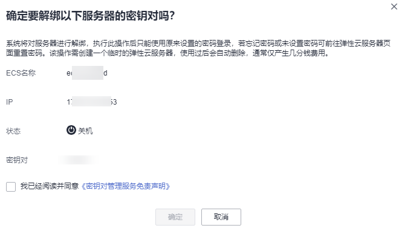

# 解绑密钥对

当用户使用的是“密钥对方式“登录弹性云服务器时，若用户需要将“密钥对方式“修改为“密码方式“，可通过密钥对管理界面解绑密钥对，KPS将对弹性云服务器进行密钥对解绑操作。解绑完成后，用户可直接使用密码登录该弹性云服务器。

## 前提条件

-   弹性云服务器的状态处于“运行中“或者“关机“状态。
-   弹性云服务器已绑定密钥对。
-   待解绑密钥对的弹性云服务器使用的是华为云提供的公共镜像。
-   执行密钥对解绑操作是通过修改服务器的“/root/.ssh/authorized\_keys“文件的方式来清除用户公钥。请确保解绑密钥对前，该文件没有被修改过，否则，解绑密钥对会失败。

## 约束条件

-   若用户未设置登录弹性云服务器的密码，或者忘记登录密码，可以到弹性云服务器管理控制台重置该弹性云服务器的登录密码，详细信息请参见《弹性云服务器用户指南》。
-   当用户创建弹性云服务器使用的是“密钥对方式“登录时，用户解绑密钥对后，若需要重新绑定密钥对，需要关机重新绑定密钥对。
-   为了能正常登录弹性云服务器，解绑密钥对后，请在弹性云服务器界面及时重置密码，详细信息请参见《弹性云服务器用户指南》。

## 操作步骤

1.  [登录管理控制台](https://console.huaweicloud.com)。
2.  单击管理控制台左上角，选择区域或项目。
3.  单击页面左侧，选择“安全与合规  \>  数据加密服务“，默认进入“密钥管理“界面。
4.  在左侧导航树中，选择“密钥对管理“，进入“密钥对管理“页面。

1.  单击“云服务器列表“。
2.  单击目标弹性云服务器所在行的“解绑“，弹出解绑密钥对的对话框。
    -   若弹性云服务器处于“关机“状态，解绑密钥对的对话框，如[图1](#fd0ef5804e8bf4257aae3f8bb0fdc5034)所示。

        **图 1**  解绑密钥对（一）  
        

    -   若弹性云服务器处于“运行中“状态，解绑密钥对的对话框，如[图2](#fa839acc6a14a47188e3625bfd874ebac)所示。

        **图 2**  解绑密钥对（二）  
        

3.  若在弹性云服务器处于“运行中“状态时解绑密钥对，需要上传私钥。单击“选择文件“，上传现有密钥对的私钥（“.pem“格式），或者将私钥拷贝至文本框中。若在弹性云服务器处于“关机“状态，请跳过此步骤。

    > **说明：** 
    >上传或者拷贝至文本框的私钥必须是“.pem“格式文件，若是“.ppk“格式文件，请参考[如何将“.ppk”格式的私钥文件转化为“.pem”格式](https://support.huaweicloud.com/dew_faq/dew_01_0099.html)进行转换。

4.  请阅读并勾选“我已阅读并同意《密钥对管理服务免责声明》“。
5.  单击“确定“，等待约1分钟后，完成该弹性云服务器密钥对的解绑操作。

    > **说明：** 
    >为了能正常登录弹性云服务器，解绑密钥对后，请在弹性云服务器界面及时重置密码，详细信息请参见《弹性云服务器用户指南》。

