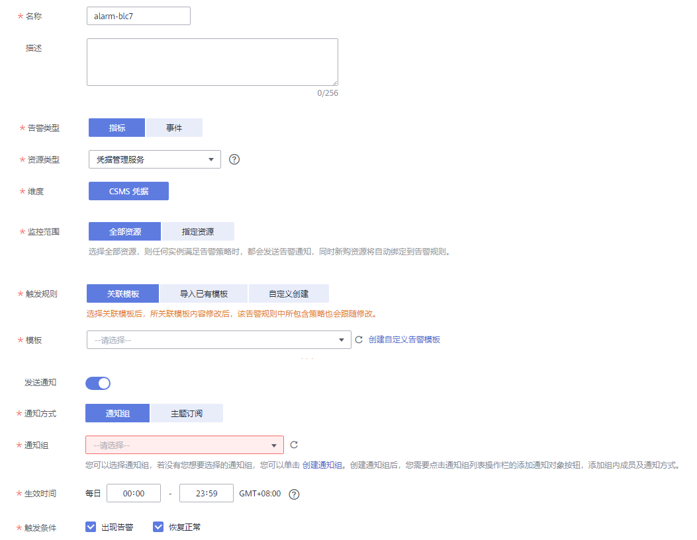

# 设置告警规则

通过设置DEW告警规则，用户可自定义监控目标与通知策略，设置告警规则名称、监控对象、监控指标、告警阈值、监控周期和是否发送通知等参数，帮助您及时了解DEW使用状况，从而起到预警作用。

## 前提条件

已创建密钥或凭据实例

## 操作步骤

1.  [登录管理控制台](https://console.huaweicloud.com)。
2.  单击管理控制台左上角，选择区域或项目。
3.  单击页面左上方的，选择“管理与监管  \>  云监控服务 CES“。
4.  在左侧导航树栏，选择“告警  \>  告警规则“，进入“告警规则“页面。
5.  在页面右上方，单击“创建告警规则“，进入“创建告警规则“界面。
6.  填写告警规则信息，如[图 设置DEW监控告警规则](#fig25412018103915)所示，填写规则如[表 设置DEW告警规则参数说明](#table020611246587)所示。

    **图 1**  设置DEW监控告警规则  
    

    **表 1**  设置DEW告警规则参数说明

    
    <table><thead align="left"><tr id="row2206424125819"><th class="cellrowborder" valign="top" width="28.202820282028203%" id="mcps1.2.4.1.1">
参数名称

    </th>
    <th class="cellrowborder" valign="top" width="38.46384638463846%" id="mcps1.2.4.1.2">
参数说明

    </th>
    <th class="cellrowborder" valign="top" width="33.33333333333333%" id="mcps1.2.4.1.3">
取值样例

    </th>
    </tr>
    </thead>
    <tbody><tr id="row720772413582"><td class="cellrowborder" valign="top" width="28.202820282028203%" headers="mcps1.2.4.1.1 ">
名称

    </td>
    <td class="cellrowborder" valign="top" width="38.46384638463846%" headers="mcps1.2.4.1.2 ">
系统会随机产生一个名称，您也可以进行修改。

    </td>
    <td class="cellrowborder" valign="top" width="33.33333333333333%" headers="mcps1.2.4.1.3 ">
alarm-blc7

    </td>
    </tr>
    <tr id="row9207102417581"><td class="cellrowborder" valign="top" width="28.202820282028203%" headers="mcps1.2.4.1.1 ">
描述

    </td>
    <td class="cellrowborder" valign="top" width="38.46384638463846%" headers="mcps1.2.4.1.2 ">
告警规则描述。

    </td>
    <td class="cellrowborder" valign="top" width="33.33333333333333%" headers="mcps1.2.4.1.3 ">
-

    </td>
    </tr>
    <tr id="row46922520010"><td class="cellrowborder" valign="top" width="28.202820282028203%" headers="mcps1.2.4.1.1 ">
告警类型

    </td>
    <td class="cellrowborder" valign="top" width="38.46384638463846%" headers="mcps1.2.4.1.2 ">
告警规则的类型，可选择指标或者事件。

    </td>
    <td class="cellrowborder" valign="top" width="33.33333333333333%" headers="mcps1.2.4.1.3 ">
指标

    </td>
    </tr>
    <tr id="row18724195505815"><td class="cellrowborder" valign="top" width="28.202820282028203%" headers="mcps1.2.4.1.1 ">
资源类型

    </td>
    <td class="cellrowborder" valign="top" width="38.46384638463846%" headers="mcps1.2.4.1.2 ">
在下拉列表框中选择“密钥管理服务”或“凭据管理服务”。

    </td>
    <td class="cellrowborder" valign="top" width="33.33333333333333%" headers="mcps1.2.4.1.3 ">
密钥管理服务

    </td>
    </tr>
    <tr id="row8969555205814"><td class="cellrowborder" valign="top" width="28.202820282028203%" headers="mcps1.2.4.1.1 ">
维度

    </td>
    <td class="cellrowborder" valign="top" width="38.46384638463846%" headers="mcps1.2.4.1.2 ">
用于指定告警规则对应指标的维度名称，根据选择的资源类型自动选择对应维度。

    <ul id="ul1220412341224"><li>KMS密钥</li><li>CSMS凭据</li></ul>
    </td>
    <td class="cellrowborder" valign="top" width="33.33333333333333%" headers="mcps1.2.4.1.3 ">
KMS密钥

    </td>
    </tr>
    <tr id="row916917562587"><td class="cellrowborder" valign="top" width="28.202820282028203%" headers="mcps1.2.4.1.1 ">
监控范围

    </td>
    <td class="cellrowborder" valign="top" width="38.46384638463846%" headers="mcps1.2.4.1.2 ">
告警规则适用的资源范围，可选择全部资源或指定资源。

    </td>
    <td class="cellrowborder" valign="top" width="33.33333333333333%" headers="mcps1.2.4.1.3 ">
指定资源

    </td>
    </tr>
    <tr id="row153791756185817"><td class="cellrowborder" valign="top" width="28.202820282028203%" headers="mcps1.2.4.1.1 ">
触发规则

    </td>
    <td class="cellrowborder" valign="top" width="38.46384638463846%" headers="mcps1.2.4.1.2 ">
根据需要可选择关联模板、导入已有模板或自定义创建。

    
 说明： 

选择关联模板后，所关联模板内容修改后，该告警规则中所包含策略也会跟随修改。

    

    </td>
    <td class="cellrowborder" valign="top" width="33.33333333333333%" headers="mcps1.2.4.1.3 ">
关联模板

    </td>
    </tr>
    <tr id="row954885614587"><td class="cellrowborder" valign="top" width="28.202820282028203%" headers="mcps1.2.4.1.1 ">
模板

    </td>
    <td class="cellrowborder" valign="top" width="38.46384638463846%" headers="mcps1.2.4.1.2 ">
选择关联或导入的模板。

    </td>
    <td class="cellrowborder" valign="top" width="33.33333333333333%" headers="mcps1.2.4.1.3 ">
-

    </td>
    </tr>
    <tr id="row1179255614589"><td class="cellrowborder" valign="top" width="28.202820282028203%" headers="mcps1.2.4.1.1 ">
发送通知

    </td>
    <td class="cellrowborder" valign="top" width="38.46384638463846%" headers="mcps1.2.4.1.2 ">
配置是否发送邮件、短信、HTTP和HTTPS通知用户。

    </td>
    <td class="cellrowborder" valign="top" width="33.33333333333333%" headers="mcps1.2.4.1.3 ">
是

    </td>
    </tr>
    <tr id="row1742165795819"><td class="cellrowborder" valign="top" width="28.202820282028203%" headers="mcps1.2.4.1.1 ">
通知方式

    </td>
    <td class="cellrowborder" valign="top" width="38.46384638463846%" headers="mcps1.2.4.1.2 ">
发送告警通知的方式，可选择通知组或主题订阅。

    <ul id="ul5836478468"><li>通知组：需要发送告警通知的通知组。创建通知组请参见<a href="https://support.huaweicloud.com/usermanual-ces/ces_01_0219.html" target="_blank" rel="noopener noreferrer">创建通知对象/通知组</a>。</li><li>主题：消息发布或客户端订阅通知的特定事件类型，若此处没有需要的主题，需先创建主题并订阅该主题，详细操作请参见<a href="https://support.huaweicloud.com/usermanual-ces/zh-cn_topic_0085216039.html" target="_blank" rel="noopener noreferrer">创建主题</a>、<a href="https://support.huaweicloud.com/usermanual-ces/zh-cn_topic_0084572343.html" target="_blank" rel="noopener noreferrer">添加订阅</a>。</li></ul>
    </td>
    <td class="cellrowborder" valign="top" width="33.33333333333333%" headers="mcps1.2.4.1.3 ">
通知组

    </td>
    </tr>
    <tr id="row193111157115814"><td class="cellrowborder" valign="top" width="28.202820282028203%" headers="mcps1.2.4.1.1 ">
生效时间

    </td>
    <td class="cellrowborder" valign="top" width="38.46384638463846%" headers="mcps1.2.4.1.2 ">
该告警规则仅在生效时间内发送通知消息。

    </td>
    <td class="cellrowborder" valign="top" width="33.33333333333333%" headers="mcps1.2.4.1.3 ">
00:00-8:00

    </td>
    </tr>
    <tr id="row248465745815"><td class="cellrowborder" valign="top" width="28.202820282028203%" headers="mcps1.2.4.1.1 ">
触发条件

    </td>
    <td class="cellrowborder" valign="top" width="38.46384638463846%" headers="mcps1.2.4.1.2 ">
可以选择“出现告警”、“恢复正常”两种状态，作为触发告警通知的条件。

    </td>
    <td class="cellrowborder" valign="top" width="33.33333333333333%" headers="mcps1.2.4.1.3 ">
-

    </td>
    </tr>
    </tbody>
    </table>

    > **说明：** 
    >“告警通知”功能触发产生的告警消息由消息通知服务SMN发送，可能产生少量费用，具体费用请参考[产品价格说明](https://www.huaweicloud.com/price_detail.html#/smn_detail)。

7.  单击“立即创建“，在弹出的提示框中，单击“确定“， 告警规则创建成功。

