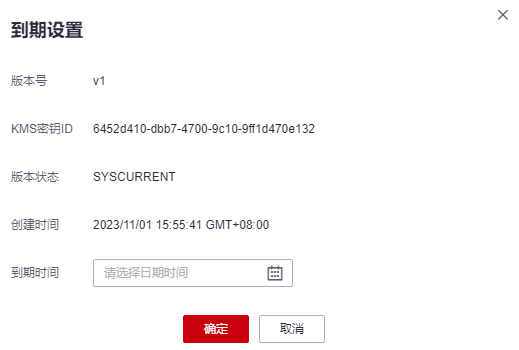

# 设置版本到期时间

该任务指导用户通过凭据详情页面进行平局版本到期时间设置。

## 操作步骤

1.  [登录管理控制台](https://console.huaweicloud.com)。
2.  单击管理控制台左上角，选择区域或项目。
3.  单击页面左侧，选择“安全与合规  \>  数据加密服务“，默认进入“密钥管理“界面。
4.  在左侧导航树中，选择“凭据管理“，进入“凭据管理“页面。
5.  单击凭据名称，进入凭据详细信息页面。
6.  在“当前版本“区，单击目标凭据版本所在行的“到期设置“。
7.  在“到期设置“页面，选择当前凭据版本期望的到期时间，单击“确定“，完成凭据版本到期时间设置。

    **图 1**  到期时间设置  
    

