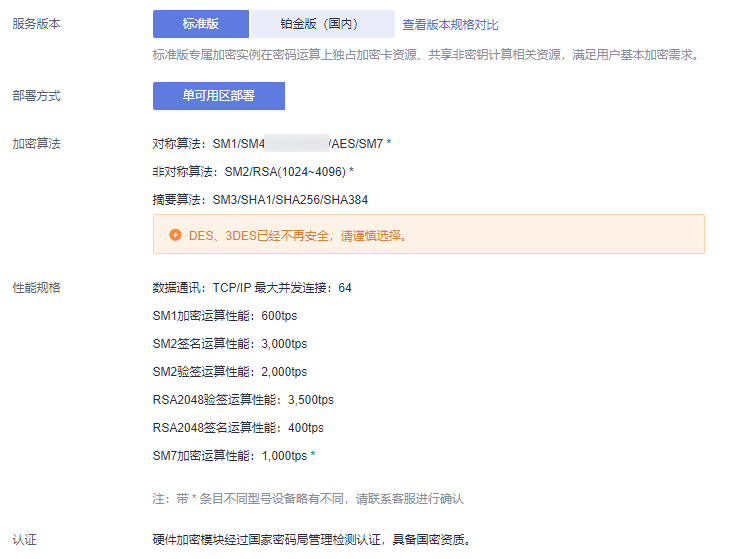
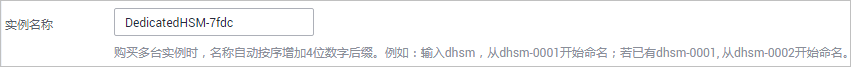
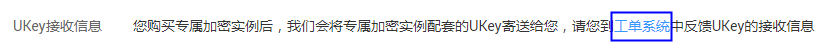
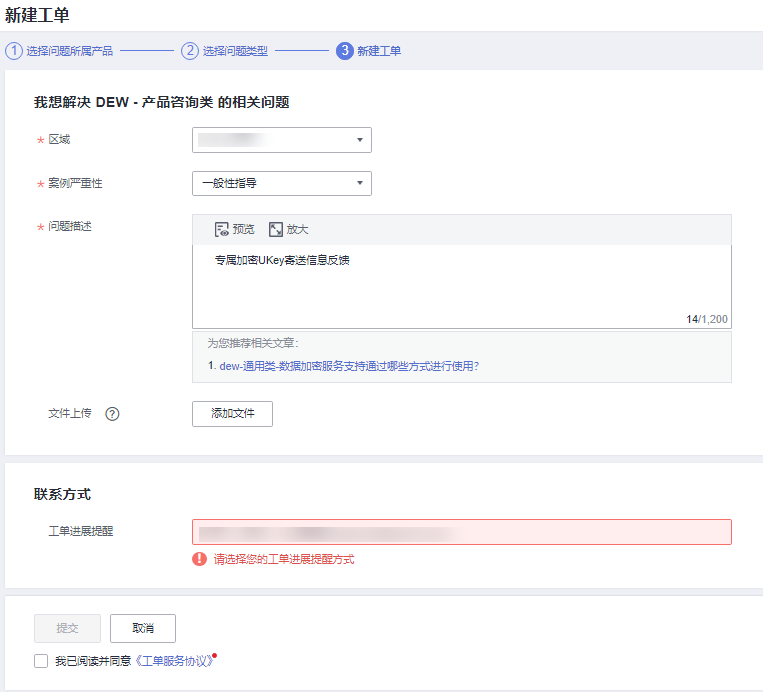

# 购买标准版

在购买标准版专属加密实例时，您需要根据自己的需要选择专属加密实例的区域、服务版本等信息，并填写您的购买量以及联系方式。

## 前提条件

已获取管理控制台的登录帐号（ 拥有Ticket Administrator权限与KMS Administrator权限）与密码。

## 约束条件

-   标准版专属加密实例仅支持包年/包月付费方式，购买后不能直接删除。
-   为了保障业务的高可靠性，您需要至少购买两个及以上专属加密实例，一个专属加密实例仅适用于测试，如需购买一个专属加密实例请联系华为云安全专家。
-   购买专属加密实例时，需要通过提交工单的方式设置“UKey接收信息“。
-   购买成功后，华为云将按照您提供的Ukey收件地址将规划的Ukey邮寄给您，您可以使用Ukey初始化并授权您的业务APP访问专属加密实例。

    同时，您需要激活专属加密实例，激活后，系统会为您分配符合您业务需求的专属加密实例。

## 操作步骤

1.  [登录管理控制台](https://console.huaweicloud.com)。
2.  单击管理控制台左上角，选择区域或项目。
3.  单击页面左侧，选择“安全与合规  \>  数据加密服务“，默认进入“密钥管理“界面。
4.  在左侧导航树中，选择“专属加密 \> 实例列表（新版）“，进入“实例列表（新版）“页面。
5.  单击页面右上方的“创建专属加密实例“。
6.  专属加密实例仅支持“包年/包月“的“计费模式“。

    **图 1**  计费模式  
    

7.  选择“当前区域“、“当前项目“。

    **图 2**  选择区域  
    

    > **说明：** 
    >-   当前区域选择确认后，当前项目选择默认。
    >-   当前项目仅支持使用默认项目，不支持自主创建。

8.  选择专属加密实例版本，如[图 标准版](#zh-cn_topic_0112991624_fig145739181978)所示，相关参数说明如[表1](#zh-cn_topic_0112991624_table4295843716304)所示。

    **图 3**  标准版  
    

    **表 1**  规格参数说明

    
    <table><thead align="left"><tr id="zh-cn_topic_0112991624_row4338993216304"><th class="cellrowborder" valign="top" width="25.61%" id="mcps1.2.3.1.1">
参数名称

    </th>
    <th class="cellrowborder" valign="top" width="74.39%" id="mcps1.2.3.1.2">
说明

    </th>
    </tr>
    </thead>
    <tbody><tr id="zh-cn_topic_0112991624_row16129226299"><td class="cellrowborder" valign="top" width="25.61%" headers="mcps1.2.3.1.1 ">
服务版本

    </td>
    <td class="cellrowborder" valign="top" width="74.39%" headers="mcps1.2.3.1.2 ">
请选择“标准版”。

    </td>
    </tr>
    <tr id="zh-cn_topic_0112991624_row16837105815489"><td class="cellrowborder" valign="top" width="25.61%" headers="mcps1.2.3.1.1 ">
加密算法

    </td>
    <td class="cellrowborder" valign="top" width="74.39%" headers="mcps1.2.3.1.2 ">
标准版专属加密实例支持的加密算法。<ul id="zh-cn_topic_0112991624_ul15751103972614"><li>对称算法：SM1、SM4、AES、SM7 *</li><li>非对称算法：SM2、RSA（1024-4096）*</li><li>摘要算法：SM3、SHA1、SHA256、SHA384
 说明： 

带*条目不同型号设备略有不同，请联系客服进行确认。

    

    </li></ul>
    

    </td>
    </tr>
    <tr id="zh-cn_topic_0112991624_row2550998316304"><td class="cellrowborder" valign="top" width="25.61%" headers="mcps1.2.3.1.1 ">
性能规格

    </td>
    <td class="cellrowborder" valign="top" width="74.39%" headers="mcps1.2.3.1.2 ">
标准版专属加密实例支持的性能规格。<ul id="zh-cn_topic_0112991624_ul178132254264"><li>数据通讯协议：TCP/IP（最大并发链接：64）</li><li>SM1加密运算性能：600tps</li><li>SM2签名运算性能：3000tps</li><li>SM2验签运算性能：2000tps</li><li>RSA2048验签运算性能：3500tps</li><li>RSA2048签名运算性能：400tps</li><li>SM7加密算法性能：1000tps *
 说明： 

带*条目不同型号设备略有不同，请联系客服进行确认。

    

    </li></ul>
    

    </td>
    </tr>
    <tr id="row18470161031417"><td class="cellrowborder" valign="top" width="25.61%" headers="mcps1.2.3.1.1 ">
认证

    </td>
    <td class="cellrowborder" valign="top" width="74.39%" headers="mcps1.2.3.1.2 ">
硬件加密模块经过国家密码管理局检测认证，具备国密资质。

    </td>
    </tr>
    </tbody>
    </table>

9.  设置“实例名称“。

    **图 4**  实例名称  
    

10. 设置专属加密实例购买的数量。
    1.  选择“购买时长“。

        可以选择1个月～1年的购买时长。

        > **说明：** 
        >勾选“自动续费“后，当服务期满时，系统会自动按照购买周期进行续费。

    2.  设置“购买数量“。

        您可以根据您的需要设置购买数量。

        为了保证业务的高可靠性，您至少需要购买2个及以上的专属加密实例。您最多可购买20个专属加密实例。

        > **说明：** 
        >一个专属加密实例仅适用于测试，如需购买一个专属加密实例请联系华为云销售代表。

11. 设置“UKey接收信息“信息。
    1.  单击“工单系统“。

        **图 5**  工单系统  
        

    2.  进入“新建工单“页面，设置UKey接收信息，如[图6](#zh-cn_topic_0112991624_fig3767122105720)所示。

        -   “问题描述“请填写为“专属加密UKey寄送信息反馈“。
        -   “案例严重性“请选择为“一般性指导“。
        -   “联系方式“请填写电话、邮箱等用于接收工单进度信息。

        **图 6**  新建工单  
        

    3.  信息填写完成后，单击“提交”。返回“我的工单”页面，可以查看到已经提交的工单列表。

        > **说明：** 
        >创建工单成功后，您可以单击工单所在行的“问题描述”，并根据工单的不同状态执行催单、提交留言、撤销工单、关闭工单等操作。

12. 确认当前配置无误后，单击“立即购买“。

    如果您对价格有疑问，可以单击“了解计费详情“，了解产品价格。

13. 在“订单详情“页面，确认订单详情，阅读并勾选“我已阅读并同意《隐私政策声明》“。
14. 单击“去支付“。
15. 在“付款“页面，选择付款方式进行付款。

    成功付款后，在专属加密实例列表界面，可以查看购买的专属加密实例信息。

    当专属加密实例的“状态“为“安装中“时，表示专属加密实例购买成功。

