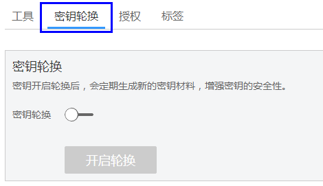
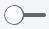
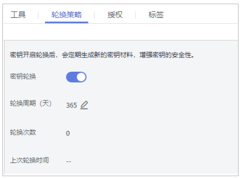

# 轮换密钥

## 操作场景

该任务指导用户通过密钥管理界面开启密钥轮换。

广泛重复的使用加密密钥，会对加密密钥的安全造成风险。为了确保加密密钥的安全性，用户需要为用户主密钥创建新的密钥材料。

用户可以通过以下两种方式创建新的密钥材料。

-   手动轮换密钥：用户可以在KMS界面创建新的用户主密钥来代替原有的用户主密钥。

    > **说明：**   
    >若华为云服务（例如：OBS）使用KMS的用户主密钥加解密数据，需要手动轮换密钥时，用户需要在KMS界面创建一个新的用户主密钥，并在OBS界面将原用户主密钥替换为新的用户主密钥。  

-   自动轮换密钥：为现有的用户主密钥开启密钥轮换，KMS自动为用户主密钥生成新的密钥材料。

    密钥轮换只会更改用户主密钥的密钥材料，用户主密钥的属性（密钥ID、别名、描述、权限）不会发生变化。

开启密钥轮换后，密钥管理会根据设置的轮换周期（默认365天）自动轮换密钥，每次轮换都会生成一个新版本的用户主密钥，如[图1](#fig19359103834415)所示。

**图 1**  密钥轮换工作原理  

自动轮换的密钥加解密数据的方式如下所示：

-   加密数据时，KMS会自动使用当前最新版本的用户主密钥来执行加密操作。
-   解密数据时，KMS会自动使用加密时所使用的用户主密钥来执行解密操作。

密钥管理会保留与该用户主密钥关联的所有版本的用户主密钥。这使得KMS可以解密使用该用户主密钥加密的任何密文。

> **说明：**   
>默认主密钥和导入的密钥不支持密钥轮换。  

## 前提条件

-   已获取管理控制台的登录帐号与密码。
-   密钥处于“启用“状态。
-   “密钥材料来源“为“密钥管理“。

## 操作步骤

1.  登录管理控制台。
2.  单击管理控制台左上角，选择区域或项目。
3.  单击页面上方的“服务列表“，选择“安全  \>  数据加密服务“，默认进入数据加密服务的“密钥管理“界面。
4.  单击目标密钥管理所在行，展开密钥管理。
5.  单击目标用户主密钥的别名，进入密钥详细信息页面。
6.  单击“密钥轮换“，进入密钥轮换管理界面，如[图2](#fig947023217481)所示。

    **图 2**  密钥轮换  
    

7.  单击，将“密钥轮换“设置为，如[图3](#f6e50215e22ef49a99f916988074aa83e)所示。参数说明如[表1](#ta8cb67818b87411dad53061d32313de1)所示。

    **图 3**  开启密钥轮换  
    

    **表 1**  用户主密钥轮换参数说明

    
    <table><thead align="left"><tr id="r2849aa0f01444575a794decd8e844b36"><th class="cellrowborder" valign="top" width="30.819999999999997%" id="mcps1.2.3.1.1">
参数

    </th>
    <th class="cellrowborder" valign="top" width="69.17999999999999%" id="mcps1.2.3.1.2">
说明

    </th>
    </tr>
    </thead>
    <tbody><tr id="rfaa8341df94b422ebe77d8086f4cc34d"><td class="cellrowborder" valign="top" width="30.819999999999997%" headers="mcps1.2.3.1.1 ">
密钥轮换

    </td>
    <td class="cellrowborder" valign="top" width="69.17999999999999%" headers="mcps1.2.3.1.2 ">
密钥轮换开关，默认。

    
：关闭。

    
：开启。

    
开启密钥轮换后，密钥在设置的轮换周期到达后开始轮换。

    
 说明： 

如果用户主密钥开启密钥轮换以后，禁用了用户主密钥，KMS也不会轮换该用户主密钥。

    
当用户主密钥恢复到“启用”状态时，密钥轮换将立即重新激活。如果刚恢复“启用”状态的用户主密钥距离上次轮换的时间已超过轮换周期，KMS将在24小时内轮换该用户主密钥。

    

    </td>
    </tr>
    <tr id="ra3a0100b49124ed4b3f49738aba25ff5"><td class="cellrowborder" valign="top" width="30.819999999999997%" headers="mcps1.2.3.1.1 ">
轮换周期（天）

    </td>
    <td class="cellrowborder" valign="top" width="69.17999999999999%" headers="mcps1.2.3.1.2 ">
轮换周期。取值范围为“30~365”的整数，默认“365”天。

    
轮换周期需要根据用户主密钥的使用频率进行设置，若密钥使用频率高，建议设置为短周期；反之，则设置为长周期。

    </td>
    </tr>
    </tbody>
    </table>

8.  单击“开启轮换“，页面显示密钥轮换详情，如[图4](#fccf4ddb4cc4543259b743554d6dbb7af)所示。

    **图 4**  密钥轮换详情  
    

    > **说明：**   
    >用户可单击，修改轮换周期。修改轮换周期后，根据新设置的轮换周期进行轮换。  

