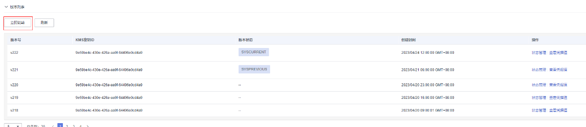

# 轮转凭据版本

该任务指导用户通过凭据详情页面进行凭据的版本轮转操作。

## 约束条件

-   凭据类型为RDS凭据。
-   需要通过IAM委托授权op\_svc\_kms账号、KMS CMKFullAccess以及RDS FullAccess相关权限（设置自动轮转才需要）。
-   凭据账号必须是RDS数据库里已存在的数据库账号。

## 手动轮转操作步骤

1.  [登录管理控制台](https://console.huaweicloud.com)。
2.  单击管理控制台左上角，选择区域或项目。
3.  单击页面左侧，选择“安全与合规  \>  数据加密服务“，默认进入“密钥管理“界面。
4.  在左侧导航树中，选择“凭据管理“，进入“凭据管理“页面。
5.  单击凭据名称，进入凭据详细信息页面。

1.  在“版本列表”区，单击“立即轮转”。

    **图 1**  版本列表  
    

2.  在“立即轮转”页面，单击“确认“，待右上角出现提示立即轮转成功，即为版本切换完成。
3.  版本轮转完成后，版本状态显示SYSCURRENT的，即为最新凭据版本。

## 自动轮转操作步骤

1.  [登录管理控制台](https://console.huaweicloud.com)。
2.  单击管理控制台左上角，选择区域或项目。
3.  单击页面左侧，选择“安全与合规  \>  数据加密服务“，默认进入“密钥管理“界面。
4.  在左侧导航树中，选择“凭据管理“，进入“凭据管理“页面。
5.  单击凭据名称，进入凭据详细信息页面。
6.  单击右上角按钮“设置轮转策略”，在设置轮转策略页面，如[图 自动轮转开关](#fig3806123715258)所示，打开自动轮转开关。

    **图 2**  自动轮转开关  
    

7.  设置完成轮转周期，单击“确定”。待右上角出现提示设置轮转策略成功提示，即为设置成功。

