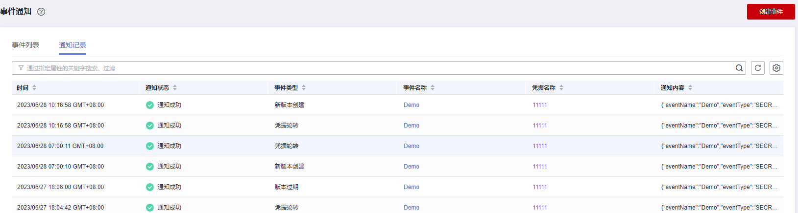

# 通知记录

该任务指导用户查看事件通知状态。

## 操作步骤

1.  [登录管理控制台](https://console.huaweicloud.com)。
2.  单击管理控制台左上角，选择区域或项目。
3.  单击页面左侧，选择“安全与合规  \>  数据加密服务“，默认进入“密钥管理“界面。
4.  在左侧导航树中，选择“凭据管理“，单击“事件通知“，进入“事件通知“页面。
5.  单击“通知记录“，进入通知记录查看页面。如[图 通知记录](#fig111561436721)所示。

    **图 1**  通知记录  
    

6.  在通知记录界面可看到已关联事件的凭据进行的变更。

