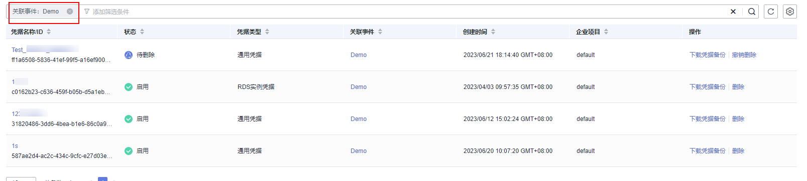

# 通过事件搜索凭据

该任务指导用户在凭据管理界面，通过关联事件搜索凭据。

## 前提条件

凭据已进行事件关联。

## 操作步骤

1.  [登录管理控制台](https://console.huaweicloud.com)。
2.  单击管理控制台左上角，选择区域或项目。
3.  单击页面左侧，选择“安全与合规  \>  数据加密服务“，默认进入“密钥管理“界面。
4.  在左侧导航树中，选择“凭据管理“，进入“凭据管理“页面。
5.  单击搜索栏，选择“关联事件“作为凭据筛选的条件，如[图 凭据搜索](#fig1648201310539)所示，通过指定关联事件搜索凭据。

    **图 1**  凭据搜索  
    

