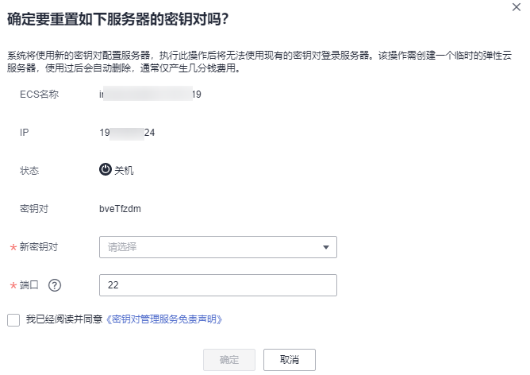

# 重置密钥对

若用户私钥丢失，用户可通过管理控制台使用新的密钥对重新配置弹性云服务器，重置完成后，用户需要使用本地保存的新密钥对的私钥登录该弹性云服务器，无法使用重置前的私钥登录该弹性云服务器。

该任务指导用户通过密钥对管理界面重置密钥对。

## 前提条件

-   待重置密钥对的弹性云服务器使用的是华为云提供的公共镜像。
-   执行密钥对重置操作是通过修改服务器的“/root/.ssh/authorized\_keys“文件的方式来替换用户公钥。请确保重置密钥对前，该文件没有被修改过，否则，重置密钥对会失败。
-   弹性云服务器的状态处于“关机“状态。

## 重置密钥对

1.  [登录管理控制台](https://console.huaweicloud.com)。
2.  进入重置密钥对入口。

    **图 1**  重置  
    

3.  弹出重置密钥对的对话框，如[图2](#fig578932141819)所示。

    **图 2**  重置密钥对  
    

4.  在“新密钥对“下拉列表中选择新的密钥对。
5.  请阅读并勾选“我已阅读并同意《密钥对管理服务免责声明》“。
6.  单击“确定“，等待约10分钟后，完成该弹性云服务器密钥对的重置操作。

